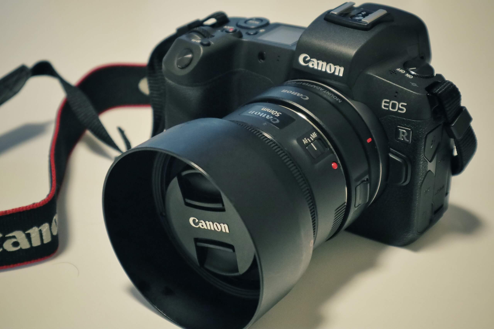
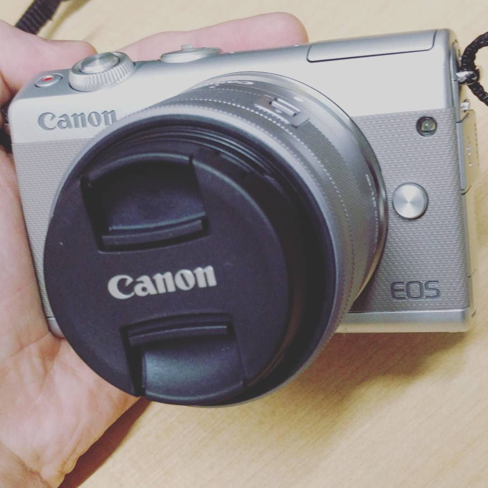
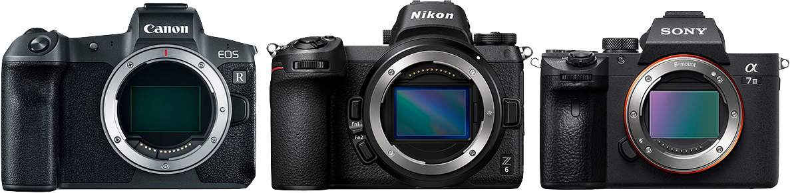
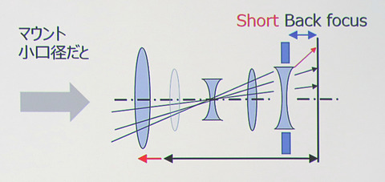
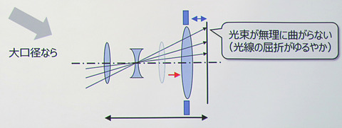
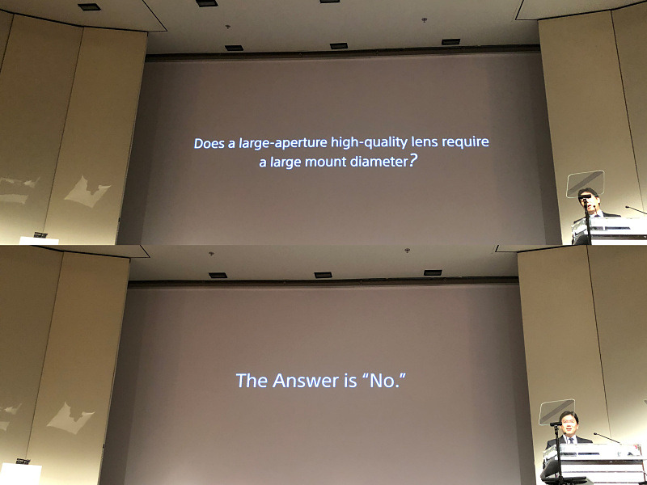
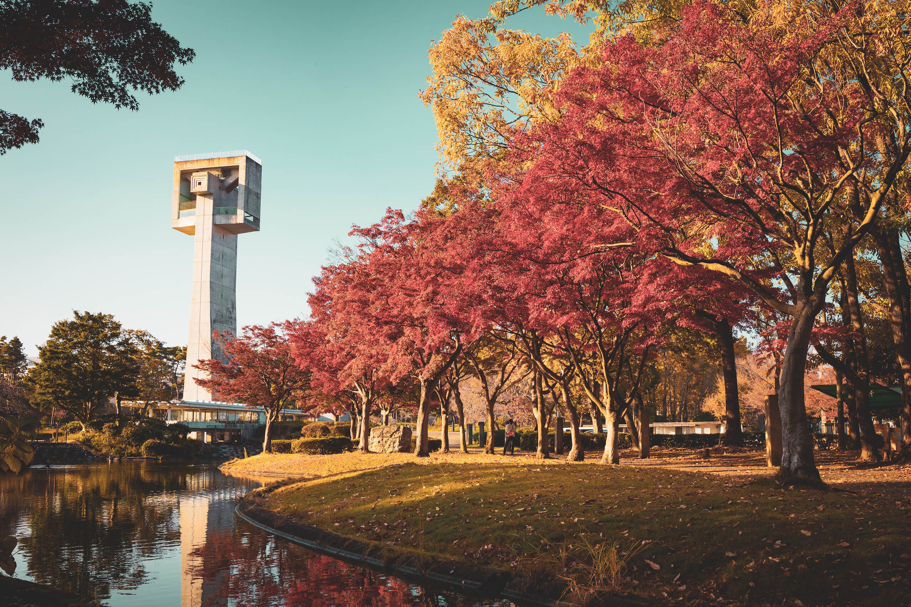

この記事は[mast Another Advent Calendar 2018](https://adventar.org/calendars/3341)の22日目の記事です。

Anotherがあるということは、[mast Advent Calendar 2018](https://adventar.org/calendars/3322) もあります。

筑波大学 情報学群の色々な人の生き様が垣間見れると思うので、ぜひ眺めてみてください。

## 概要
今日はフルサイズミラーレス戦争のお話です。

SONYのα7シリーズが2013年に出てから、フルサイズミラーレスはしばらくSONYの独壇場でした。

そして今年2018年は、長年重い腰を上げずにいたCanon、Nikonがフルサイズミラーレスのカメラを発売し（Panasonicも発表しましたね）、遂に戦いの火蓋が切られる形となりました。

僕も今年EOS Rを購入し、フルサイズミラーレスデビューを果たしたわけですが、なぜSonyやCanonを選ばなかったのか。

その理由をお話します。

## 僕とカメラ
少し僕のカメラ人生のお話をさせてください。

カメラ人生と言っても、カメラを始めたのは1年ほど前の話です。

なんとなくスマホよりきれいに撮れるカメラが欲しくて、Canonで一番安い、また発売されたばかりの[EOS M100](https://cweb.canon.jp/eos/lineup/m100/index.html) を2017年10月に購入しました。

すごく軽く、また写りもいいので僕はみるみるカメラにハマり、レンズも何本か追加しました。

M100で撮れた一番のお気に入りはこのレッサーパンダです。

これは [EF70-300mm F4-5.6 IS II USM](https://cweb.canon.jp/ef/lineup/tele-zoom/ef70-300-f4-56ii/) という望遠レンズを使ってるわけですが、こういう一眼レフ用の大きなレンズをつけると当然ですが非常にバランスが悪くなるわけです。

それ以外にも、許容可能なISO感度の低さや、連写時のバッファの少なさ、解像感の足りなさ等、若干不満点も増えてきました。

写真を取り始めて1年立ったのもあり、そろそろ買い替えを考え始めました。

## 一眼レフかミラーレスカメラか
時代は変わり、僕はミラーレスの方がほとんどの部分で優れていると思っています。

構造が簡単な分、小さい、軽い、そして安いだけでなく、フランジバックが短い等、光学的にも優れています。

また、露出の確認ができない光学ファインダーはスマホ、コンデジ世代の僕にとってはありえませんでした。

## フルサイズは必要なのか？
次に、買い替えにあたってセンササイズを考えました。

最初に結論を言うと、センサがフルサイズである必要はないというのが僕の考えです。

高解像度な画像が必要でないならば、APS-C、もしくはそれ以下のセンササイズのカメラでも最近は十分な画質が得られますし、ボケも単焦点レンズを選んで使えばそれなりに得ることができます。

そしてなにより、コンパクトで軽いことは非常に重要です。

しかし、本格的に写真を撮りたいと思ったときに、レンズのバリエーションが足りないと感じました。

また、M100を使ってて一番苦痛に感じていた、グリップ感の物足りなさを解消できるAPS-Cのミラーレスカメラは存在しませんでした。（バッテリーグリップやグリップエクステンションを付けけばいいのでしょうが…）

僕はより快適なカメラライフを送る上で、フルサイズを選択することにしました。

## Canon vs Nikon vs Sony

最後に、メーカーです。

買うとしたら
* Canon EOS R
* Nikon Z6
* Sony α7III

の３つのうちどれかです。

これらはどれも同じようなスペックのカメラで、値段帯も非常に似通っています。

Nikonは、周りに使ってる人も少なく、なぜかあんまりときめかなかったので、そうそうに選択肢から外れました。

CanonかSonyかは本当に最後まで悩みました。

そこまで大きな差ではないのですが、しかし明らかにスペックが高いのはα7IIIです。

* 圧倒的な連射速度（EOS R：5コマ、α7III：10コマ）
* SDスロット枚数（EOS R：1枚、α7III：1枚）
* 常用ISO感度（EOS R：100-40000、α7III：100-51200）
* 瞳認識AF（EOS R：ワンショットのみ、α7III：常時）
* ボディー内手ぶれ補正（EOS R：なし、α7III：あり）
* 等など

それでも最終的にCanonに決めたのは、

* グリップ感
* マウント径
* 将来性

の３つを考えた結果でした。

### グリップ感について
先程から何度か言っているグリップ感ですが、僕は手持ちで望遠レンズを使うことも多く、また将来的にsigmaの大口径単焦点を使いたいと思っていたので、グリップ感は非常に大事でした。

そのため、何度もヨドバシカメラに足を運び、実際に握って比較をしました。

α7IIIは小さくするためにかなりグリップが浅く、また小指がはみ出してしまいました。

対してEOS Rはかなり深く、また小指までしっかりにぎることができ、ある程度の重さのレンズまでなら片手でもしっかり撮影することができます。

また、グリップを握って場所を移動することも不安なくできそうでした。

### マウント径について
マウント径については諸説あるので、なかなか断言することが難しいのですが、僕の感じていることをお話したいと思います。

SonyのEマウントの内径46mmに対し、Canon RFマウントは54mmあります。

Canonはこの大口径マウントを軸にEOS Rのプロモーションをしています。

先日も「[キヤノン説明会で聞いた「ミラーレス大口径マウントのメリットと実例」 - デジカメ Watch](https://dc.watch.impress.co.jp/docs/news/1158578.html) 」といった記事が出ていました。

その記事によると、大口径の方が光の無理な曲げが発生しなくて設計がしやすい、とのことでした。

これは、実際そのとおりだと思います。

しかし、SONYはSONYで完全に大口径は必要ないと明言しています。

これも実際そのとおりだと思っていて、マウント径が小さくてもしっかりとした技術さえあれば高画質なレンズは実現できますし、事実Eマウントの写真でマウント径による画質の低下を感じたことはありません。

つまり、あくまで設計しやすいのは大口径であるが、ちゃんと設計すればその必要はないということなのでしょう。

ちなみに、後玉のレンズがそんなに大きいレンズはない！といったブログ記事が出ていたりしますが、フランジバックを考えていなかったり、結構適当な検証も多いのであまり信用しないほうがいいと思います。

といっても、メーカー自体もポジショントークしかしないので何を信じれば…という感じですが。

自由度という観点においては実際大口径の方が高いのは事実であり、また強度、レンズのフォルム（SonyのGMレンズなどによくある変なクビレが気になる）も考慮した結果、僕の中ではEOS Rに軍配が上がりました。

### 将来性
α7IIIとEOS Rを比較すると、ほとんどの部分でα7IIIが勝ちます。

これは事実です。

値段はほとんど一緒か、α7IIIのほうが若干安いくらいなのにα7IIIの方が優れています。

しかし、これはα7IIIとEOS Rを比較した場合の話です。

EOS RはCanonが出したはじめてのフルサイズミラーレスです。

様子見という意味もあったり、自社の一眼レフ販売数を大幅に食わないようになど、色々な調整があったと考えています。

僕は長い目で見たときに、CanonもきっとSONYと同等か、それ以上のカメラを今後出してくると信じています。

そう考えたときに、RFレンズで揃えていって問題ないと考えました。

## 実際に使ってみて
もうEOS Rを買って2ヶ月が経ちます。

主に [RF35mm F1.8 MACRO IS STM](https://cweb.canon.jp/eos/rf/lineup/rf35-f18/) をつけて使っていますが、その解像度の高さには驚かされるばかりです。

若干操作系統のカスタマイズ性の低さに不満はありますが、概ね満足しています。

利用していて感じた点については後日まとめたいと思います。

## まとめ
今日は、僕がなぜEOS Rを選んだのか、その過程についてお話をしました。

もともとCanonを使っており、Canonの色も好きで最初からEOS Rありきな選択をしていた気もしますが、もし誰かの参考になったら幸いです。

カメラの選択については宗教のようなものだと思っています。

また、何で撮るかより、何を撮るかのほうが大事なのは明らかです。

あんまり深く’考えすぎず、自分のお気に入りのカメラで、ぜひベストなカメラライフをお送りください。
