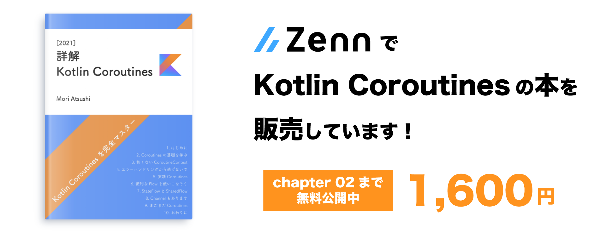

LiveDataは非常に便利ですが、[以前も書いた](https://at-sushi.work/blog/10)とおり、hotとcoldがわかりにくい、内部がjavaのためnon nullを扱いにくい等、ところどころ不自由な点があります。

また、kotlin coroutines flowを採用している場合、どこまでflowで流して、どこでLiveDataに変換するか、という問題に直面します。

なら、いっそのことLiveDataを使わず、全てflowでMVVMを完結させられるのではないかと思い、今回試してみました。

その際に気をつけた点、気がついたこと等をまとめます。

#### - 2020/11/15追記 -
この記事は[SharedFlow](https://kotlin.github.io/kotlinx.coroutines/kotlinx-coroutines-core/kotlinx.coroutines.flow/-shared-flow/index.html), [StateFlow](https://kotlin.github.io/kotlinx.coroutines/kotlinx-coroutines-core/kotlinx.coroutines.flow/-state-flow/index.html)がリリースされる前に書かれています。

ConflatedBroadcastChannel等、一部古い書き方がされています。

詳しくは[こちらの記事](https://at-sushi.work/blog/24)も参考にしてください。

## サンプルアプリ
今回作成したコードは[ここ](https://github.com/Mori-Atsushi/android-flow-mvvm-sample)に公開しています。

Githubのユーザ名を入力するとその人のリポジトリ一覧が表示されるアプリケーションになっています。

top|detail
:--:|:--:
|


## アーキテクチャ
標準的なMVVMの形になっています。


Api層ではsuspend functionで返し、repository層でflowに変換します。

このあたりは、特に特別なことをしていないので説明を省きます。

以下にViewとViewModelをbindingする詳細な方法について示します。

### ViewModel -> View
一度 [ViewModelScope](https://developer.android.com/topic/libraries/architecture/coroutines#viewmodelscope)にて、[ConflatedBroadcastChannel](https://kotlin.github.io/kotlinx.coroutines/kotlinx-coroutines-core/kotlinx.coroutines.channels/-conflated-broadcast-channel/)に変換します。

これを行わず、repository層のflowを直接viewでobserveした場合、画面回転等でviewを再生成した際にAPIが余計に叩かれる可能性があります。

ConflatedBroadcastChannelはobserve時に最後の値を再送信してくれるため、Viewが再生成された場合も正しく再表示されます。

```kotlin
class TopViewModel(
    private val repository: RepoRepository
): ViewModel() {
    private val _resource = ConflatedBroadcastChannel<Resource<List<Repo>>>()
    private val resource = _resource.asFlow()
    val data = resource.map { it.valueOrNull.orEmpty() }

    init {
        repository.getRepoList("Google")
            .onEach { _resource.send(it) }
            .launchIn(viewModelScope)
    }
}
```

ViewModelが公開してるflowを[LifecycleScope](https://developer.android.com/topic/libraries/architecture/coroutines#lifecyclescope)でobserveします。

LifecycleScopeはonDestroy時にobserveを解除してくれるので、クラッシャやメモリリークの心配はありません。

この処理は頻繁に行うので、以下のようなextensionを用意しました。

```kotlin
inline fun <T> AppCompatActivity.bind(
    source: Flow<T>,
    crossinline action: (T) -> Unit
) {
    source.onEach { action.invoke(it) }
        .launchIn(lifecycleScope)
}
```

```kotlin
class TopActivity : AppCompatActivity() {
    private val viewModel: TopViewModel by viewModel()

    private lateinit var binding: ActivityTopBinding
    private lateinit var adapter: RepoAdapter

    override fun onCreate(savedInstanceState: Bundle?) {
        super.onCreate(savedInstanceState)

        binding = DataBindingUtil.setContentView(this, R.layout.activity_top)
        adapter = RepoAdapter()

        bind(viewModel.data) {
            adapter.setList(it)
        }
    }
}
```

Fragmentの場合は、ViewLifecycleOwnerを使ってください

```kotlin
inline fun <T> Fragment.bind(
    source: Flow<T>,
    crossinline action: (T) -> Unit
) {
    source.onEach { action.invoke(it) }
        .launchIn(viewLifecycleOwner.lifecycleScope)
}

```

LiveDataのように、xmlから直接参照することはできませんが、比較的シンプルに書けると思います。

### View -> ViewModel
こちらはLiveDataを使ってるときと同様にViewModelのfunctionを叩きます。

それを [BroadcastChannel](https://kotlin.github.io/kotlinx.coroutines/kotlinx-coroutines-core/kotlinx.coroutines.channels/-broadcast-channel/)  に送るようにすると、宣言的にViewModelが書けるようになります。

```kotlin
class TopViewModel(
    private val repository: RepoRepository
) : ViewModel() {
    private val _submitEvent = BroadcastChannel<Unit>(Channel.BUFFERED)
    private val submitEvent = _submitEvent.asFlow()

    init {
        submitEvent
            .flatMapLatest { repository.getRepoList("Google") }
            .onEach { ... }
            .launchIn(viewModelScope)
    }

    fun submit() {
        viewModelScope.launch {
            _submitEvent.send(Unit)
        }
    }
}
```
```kotlin
class TopActivity : AppCompatActivity() {
    private val viewModel: TopViewModel by viewModel()

    private lateinit var binding: ActivityTopBinding

    override fun onCreate(savedInstanceState: Bundle?) {
        super.onCreate(savedInstanceState)

        binding = DataBindingUtil.setContentView(this, R.layout.activity_top)
        binding.searchView.setOnQueryTextListener(object : SearchView.OnQueryTextListener {
            override fun onQueryTextSubmit(query: String?): Boolean {
                viewModel.submit()
                return false
            }

            override fun onQueryTextChange(newText: String?): Boolean {
                return false
            }
        })
    }
}
```


### View <-> ViewModel (2-way data binding)
双方向のDataBindingは、前述した2つを組み合わせることで実現できます。

1点気をつけなければ行けないところは、viewを反映させるところで現在の値と比較し、違う場合のみ更新するようにしないと、無限ループになったり、予期せぬ動きになります。

```kotlin
class TopViewModel(
    private val repository: RepoRepository
) : ViewModel() {
    private val _userName = ConflatedBroadcastChannel("Google")
    val userName = _userName.asFlow()

    fun setUserName(userName: String) {
        viewModelScope.launch {
            _userName.send(userName)
        }
    }
}
```
```kotlin
class TopActivity : AppCompatActivity() {
    private val viewModel: TopViewModel by viewModel()

    private lateinit var binding: ActivityTopBinding

    override fun onCreate(savedInstanceState: Bundle?) {
        super.onCreate(savedInstanceState)

        binding = DataBindingUtil.setContentView(this, R.layout.activity_top)
        binding.searchView.setOnQueryTextListener(object : SearchView.OnQueryTextListener {
            override fun onQueryTextSubmit(query: String?): Boolean {
                return false
            }

            override fun onQueryTextChange(newText: String?): Boolean {
                viewModel.setUserName(newText.orEmpty())
                return false
            }
        })

        bind(viewModel.userName) {
            val current = binding.searchView.query.toString()
            // Need to compare with current value
            if (current != it) {
                setQuery(query, false)
            }
        }
    }
}
```

## 気になる点
LiveDataとひとつ大きく違う点は、LiveDataはonStartからonStopまで動作するのに対し、この書き方ではobserve時からonDestoryまで動作します。

そのため、onStopで止まっている裏のactivityの画面更新が走る可能性があります。

onDestory時にobserveは解除されるため、クラッシュしたりすることはありませんが、不要な処理が走っている点は気になります。

パフォーマンスが悪化するようであれば、onStartからonStopの間のみ動作させるよう検討する必要があるかもしれません。


## 感想とまとめ
今回試してみて、LiveDataとflowを両方勉強しなくて良くなる点は良いと感じました。

ViewModel内のHot streamの変換も、初見だと少しビビりますが、明示的になるので慣れればわかりやすいのではないかと思っています。

[ここ](https://github.com/Kotlin/kotlinx.coroutines/issues/1261]) や [ここ](https://github.com/Kotlin/kotlinx.coroutines/pull/1716)で議論されている、shareInやcacheのoperatorが追加されると、また変わってくるかもしれません。

xmlから直接参照できなくなる問題は、個人的にはそこまで不便を感じませんでした。

一方、デメリットになりうると思ったのは、streamで扱う必要のない情報もflow化したくなり、不必要に複雑になる可能性がある点です。

必要に応じてsuspend function, 通常のfunctionと使い分けることが重要だと感じました。

RxJava3も登場しましたが、今後android開発が何が主軸になるのか、注視していきたいところです。

**- 2021/01/31追記- **

Kotlin Coroutinesの解説本をZennにて販売しています。より詳しく学びたい方は、こちらも合わせて確認してみて下さい。

[](https://zenn.dev/at_sushi_at/books/edf63219adfc31)
[詳解 Kotlin Coroutines \[2021\] | Zenn](https://zenn.dev/at_sushi_at/books/edf63219adfc31)