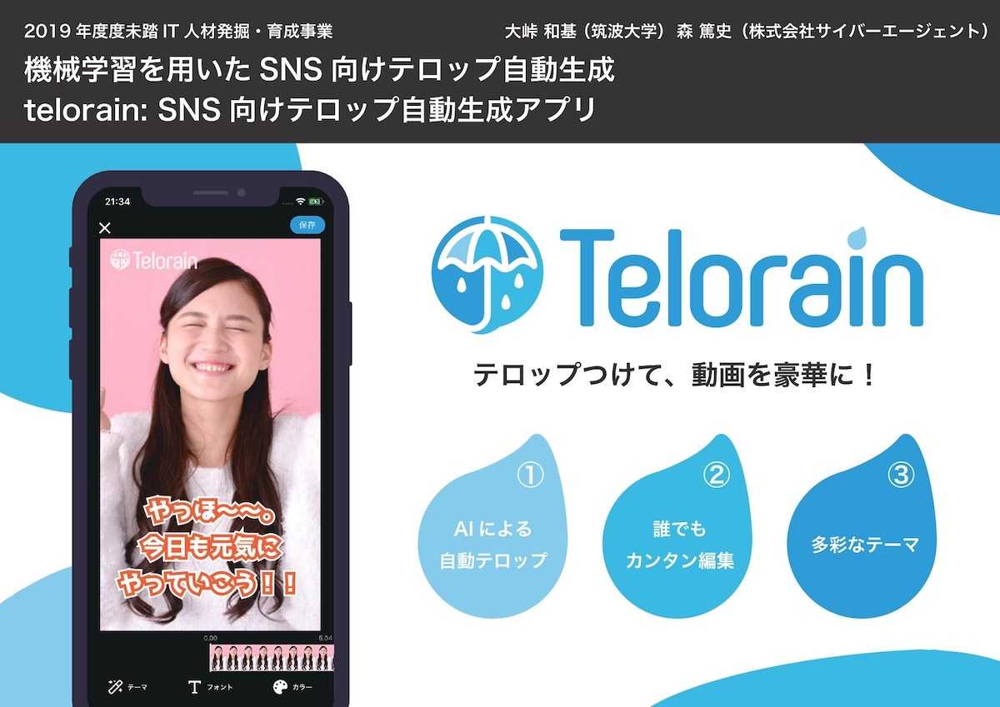
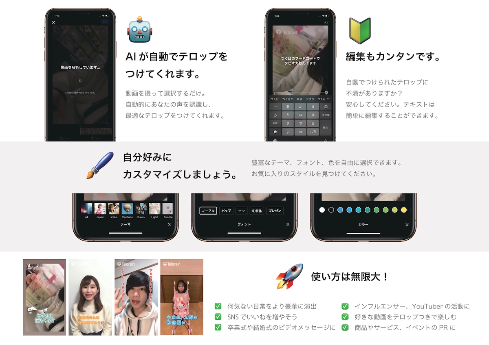
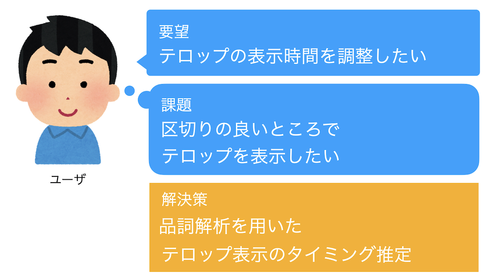
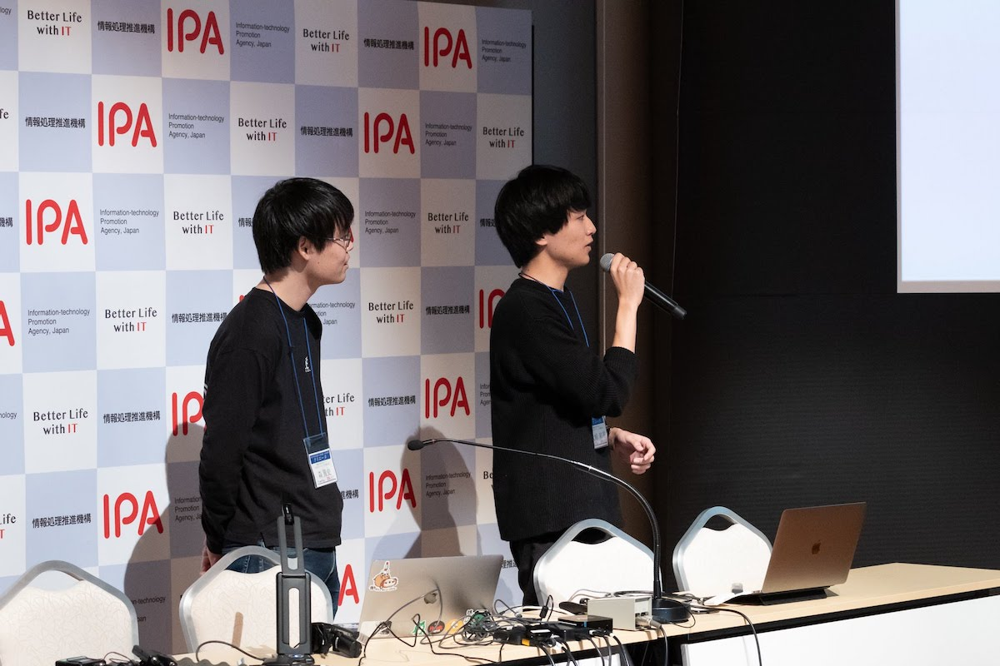
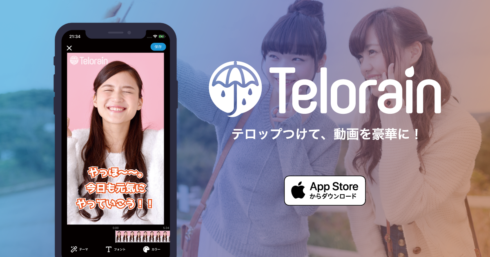

2019年度未踏事業を終え、先日スーパークリエータに認定して頂きました。

[2019年度未踏IT人材発掘・育成事業の「スーパークリエータ」17名を認定：IPA 独立行政法人 情報処理推進機構](https://www.ipa.go.jp/jinzai/mitou/2019/20200528.html)

いい機会なので、未踏に参加した背景から追えての感想まで、一通り振り返りたいと思います。

## 未踏事業とは
経済産業省所管の独立行政法人 情報処理推進機構(IPA) がやっている若手育成のプログラムです。

ざっくり説明すると、25歳未満の個人、または個人からなるグループが対象で(法人格等はNG)、企画書を提出し、採択されれば年間最大約200万円の支援を得ることができるといったものになっています。

プロジェクトを指導/助言してくれるPMがいたり、同時期の採択者や未踏OBともやりとりしながら進められるのが大きな特徴です。

なかなか伝わりにくいのですが、このあたりを見て頂けると。

[未踏事業ポータルページ：IPA 独立行政法人 情報処理推進機構](https://www.ipa.go.jp/jinzai/mitou/portal_index.html)

## 採択まで
未踏の存在自体は以前から知っていましたが、なかなかいい題材がなく、尻込みしていた、というのが本当のところです。

そんなところに[大峠](https://twitter.com/0MeO?ref_src=twsrc%5Egoogle%7Ctwcamp%5Eserp%7Ctwgr%5Eauthor)から、未踏でテロップ自動生成アプリを作らないか、と声をかけてもらいました。

僕自身、動画サービスに関心があり、テロップの効果的な使い方には注目をしていました。

そこで大峠とタッグを組み、2人で未踏に申請をすることにしました。

採択までの戦略としては、とことん過去の申請書を読み込むことでした。

採択された例はもちろん、採択されなかった例も読み込み、大峠とどうすれば通るのか、何を見てるのかを徹底的に分析しました。

大学の研究室から多くの採択例があったのが幸いでした。

## 採択と副業申請
予めわかっていたことなんですが、応募は3月で学生でしたが、採択の結果通知は就職後、5月に来ました。

IPAと業務委託契約を結ぶ必要があるので、会社に副業申請をし、また会社からIPAに承諾書を送る必要がありました。

就業中の未踏実施は前例もあったので、無事申請も通りました。

その際は人事や事務の多くの方にお世話になりました、ありがとうございました。

そうして未踏事業と会社の並行生活が始まりました。

## 開発
今回、「機械学習を用いたSNS向けテロップ自動生成」というテーマで、動画にテロップを簡単につけられるiOSアプリの開発を行いました。

 |
:--:|:--:


以下にさらに詳しい成果が乗ってるので、もしよかったらご覧ください。

[2019年度未踏IT人材発掘・育成事業プロジェクト成果：IPA 独立行政法人 情報処理推進機構](https://www.ipa.go.jp/jinzai/mitou/2019/seika.html)

---

僕は主にサーバのアーキテクチャ周り及び、iOSアプリのUI周りを主に担当しました。

大峠はサーバ側の実装とiOSアプリのテロップレンダリングを担当した形です。

とはいいつつ、結構担当は入れ替わりつつ開発は進んでいきました。

普段業務ではandroidアプリを開発しており、androidとiOS、kotlinとswiftの違いに右往左往しました。

特にswiftのinitializerやgenerics周りはkotlin及びJVMと全く感覚が異なり、今でもよくわかってないところが多いです。

---

開発上最も気をつけたのは、 `MVP (Minimum Viable Product)` がなになのか見失わないようにすることです。

テロップを自動生成して動画を華やかにする、というのは非常にキャッチーで、開発初期から多くの要望、そしてアイディアが出てきました。

実際のところ、それらのほどんどを実現する能力もあったと思っています。

しかし、私達が目指したのは超高機能なテロップ編集アプリではなく、多くの人がテロップを付けてSNSにアップするようになる世界でした。

人々の生活にインパクトを与えるには、シンプルでわかりやすく、使いやすい必要性がありました。

そのため、少し作ってはテスト配布を行い、直接インタビューしたりアンケートを集めて、徹底的にユーザヒアリングを行いました。

こういった開発をする上で、2点気をつける必要があると思っています。

### 1. すべてのユーザの言うことを聞かない

ユーザは非常に多種多様です。

すべてのユーザの意見を満遍なく取り入れると、誰も望まないものが出来上がります。

そこで、ユーザのクラスタリングを行います。

例えば、以下のようにです。
```text
・お金を払ってくれそうなユーザ
・お金は払わないが継続利用してくれるユーザ
・実際は使わないユーザ
```

これはインタビューやアンケートをする実施する際に、継続して使いたいか、お金を支払いたいか等の、ユーザの熱量に関する質問を織り交ぜることで収集します。

当然ですが、より上に近いユーザの意見を重要視します。

また、お金を払ってくれるそうなユーザであっても、我々が想定してるユースケースと大きく異る意見は無視します。（それがよほど大部分を占めない限り）

せっかく意見をもらっているのに、無視をするというのは非常にひどい話のようですが、より良いプロダクトを作るために心を鬼にします。

### 2. ユーザは本当にほしいものを知らない

であれば、ユーザの言うことを優先度をつけて順番に実装していけばいいのかというと、もちろんそうでもありません。

ユーザ（特に今回我々がターゲットとしたユーザ）は技術にそこまで詳しくありませし、なにより誰も自分が何がほしいのか完全には理解していません。

この人はAが欲しいと言っているが、実際はBの解決策のほうがより効果的に問題を解決してくれるかもしれません。

私達のプロダクトの場合、初期の頃はテロップの表示時間を調整する機能が熱望されましたが、表示時間の推定プログラムが優秀になるにつれ、その声は薄れていきました。



ユーザの意見を鵜呑みにするのではなく、一度分解し整理し、効果的な方法を考える必要がありました。

---

多くの機能がユーザの意見により作られ、ブラッシュアップされました。ありがとうございました。

## 未踏コミュニティ
未踏に参加して一番良かったと思うのは、同世代の優秀な（頭のおかしい）方々と会うことができました。

大小合わせると月に1度程度ミーティングがあり、互いのプロジェクトの進捗を確認したり、意見を交換したりしました。

人材発掘・育成事業というだけあって、どこから発掘してきたんだという感じの人がゴロゴロいました。

また、ジャンルも多種多様で、僕らのようなアプリケーション開発から、VR、ロボット、暗号系等様々なプロジェクトがあり、非常に勉強になりました。

僕自身もともとアプリケーションレイヤーにしか興味がなかったのですが、もっと広い視野を持って、課題に取り組んでいく必要があるなと感じました。



## 仕事との両立
今回のプロジェクトで、一番苦労したのは仕事との両立です。

会社でも、Androidチームのリーダという大きな役割を担い、またデザインリニューアルやリアーキテクチャ等の非常に大きなプロジェクトが動いていました。

[新卒1年間でやった仕事をちゃんとまとめる - Blog - Mori Atsushi](https://at-sushi.work/blog/9)

もともと、会社に帰ったあとは未踏の作業をする予定でしたが、そんな余力がある日はほとんどなく、毎回MTGの直前に追い込んで進捗を出す、というサイクルでした。

大峠には非常に大きな心配と負担を強いたと思っています。ご迷惑おかけしました。

もともと自分の能力値以上に仕事を増やす傾向があるのですが、社会人という責任ある立場になった以上、もう少し慎重にスケジュールを考える必要があると感じました。

## 開発から外れた理由
未踏終了後、telorainの開発は続いていますが、私自身は開発から外れています。

非常に多くの思いを込めて作ってきたからこそ、かなり悩みましたが、多くの事柄を総合的に考えての判断でした。

主な理由は以下のようなものです。
```text
・iOSアプリ開発よりもandroidアプリ開発を極めたい
・大規模かつ複数人での開発を支えたい
・プラットフォームを作りたい
```

telorainが大成功を収めた日にはきっと舌打ちをするんだろうなと思いつつ、その日を楽しみに見守ることにしました。

新しいチームで正式リリースされたので、ぜひ試してみてください。

[](https://apps.apple.com/jp/app/telorain/id1504837403)

[‎「telorain」をApp Storeで](https://apps.apple.com/jp/app/telorain/id1504837403)

## スーパークリエータになって
幸いなことに今回、スーパークリエータに認定して頂くことができました。

まだ日本に344人しかいないらしく(またその中には落合陽一先生含め名だたる人が数々…)、本当にありがたいことです。

採択当初から大峠と「スパクリは必ず獲る」と意気込み、それなりの戦略をもって取り組んできましたが、いざ認定して頂くとプレッシャーを感じます。

昨年度は会社のベストルーキー賞もいただき、非常に充実した1年間でしたが、2020年度、影が薄れたと言われないよう、精一杯期待に答えたいと思っています。