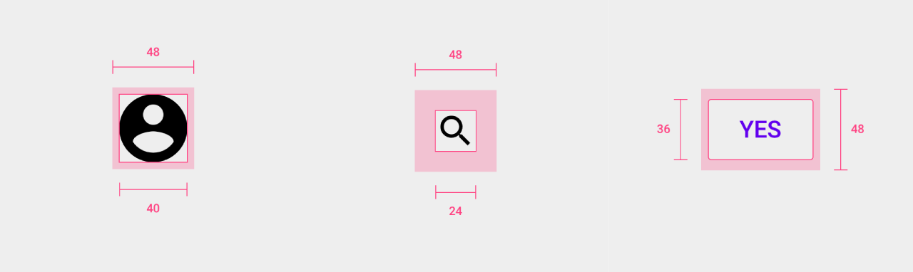
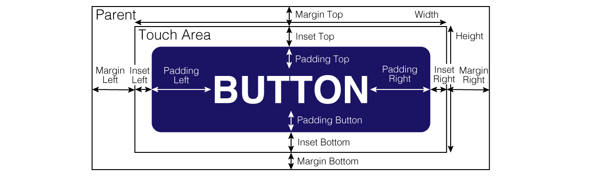

Androidに置いてアクセシビリティの観点からボタンのサイズは縦横共に最小48dpを推奨されています。（iOSは44pxみたいです）

[Material Design](https://material.io/design/usability/accessibility.html#layout-and-typography)

また、デザイン上そのサイズに満たない場合でも、その周りもタッチできることが求められています。



今回はそれの具体的な実装方法について紹介したいと思います。

##  material-componentsを使っている場合
[material-components](https://github.com/material-components/material-components-android)を使ってる場合は非常に簡単です。

margin / paddingとは別にinsetという概念が用意されており、タップエリアを指定できるので、それを使いましょう。



以下のようにheightを48dpにしていても、topとbottomにinsetを8dpつけることで、touch areaを小さくせずに見た目を32dpに変更できます。

```xml
<!-- res/layout/activity_test.xml -->
<?xml version="1.0" encoding="utf-8"?>
<FrameLayout xmlns:android="http://schemas.android.com/apk/res/android"
    android:layout_width="match_parent"
    android:layout_height="match_parent">

    <com.google.android.material.button.MaterialButton
        android:layout_width="wrap_content"
        android:layout_height="48dp"
        android:layout_gravity="center"
        android:insetTop="8dp"
        android:insetBottom="8dp"
        android:text="button" />
</FrameLayout>
```

## material-componentsを使っていない場合
themeがmaterial componentsのものでない場合、MaterialButtonを使うとクラッシュします。

よほどの理由がなければmaterialのthemeをおすすめしますが、古くからのシステム等でそれができない場合もあると思います。

その場合は、以下のようにFrameLayout等で囲ってあげると良いです。

```xml
<!-- res/drawable/button-ripple.xml -->
<?xml version="1.0" encoding="utf-8"?>
<ripple xmlns:android="http://schemas.android.com/apk/res/android"
    android:color="?android:attr/colorControlHighlight">
    <item android:id="@android:id/mask">
        <shape>
            <corners android:radius="5dp" />
            <solid android:color="@color/colorPrimary" />
        </shape>
    </item>

    <item>
        <shape>
            <corners android:radius="5dp" />
            <solid android:color="@color/colorPrimary" />
        </shape>
    </item>
</ripple>
```

```xml
<!-- res/layout/activity_test.xml -->
<?xml version="1.0" encoding="utf-8"?>
<FrameLayout xmlns:android="http://schemas.android.com/apk/res/android"
    android:layout_width="match_parent"
    android:layout_height="match_parent">

    <FrameLayout
        android:id="@+id/button"
        android:layout_width="wrap_content"
        android:layout_height="44dp"
        android:layout_gravity="center"
        android:clickable="true"
        android:focusable="true"
        android:paddingTop="8dp"
        android:paddingBottom="8dp">

        <TextView
            android:layout_width="wrap_content"
            android:layout_height="match_parent"
            android:background="@drawable/button_ripple"
            android:gravity="center"
            android:paddingStart="16dp"
            android:paddingEnd="16dp"
            android:text="BUTTON"
            android:textColor="@color/white"
            android:textStyle="bold" />

    </FrameLayout>
</FrameLayout>
```

click listenerは外側のFrameLayout (@+id/button) に指定してください。

clickableなviewの子にripple effectのviewを配置しても、自動的にclickが伝播するので問題なくrippleします

## まとめ
推奨サイズが48dpとかなり大きく、なかなかそれに完全に従うことは難しいと思います。

しかし、タッチエリアが小さいと多くのユーザがイライラすると思うので、ぜひ積極的に広げることを検討していただければと思います。