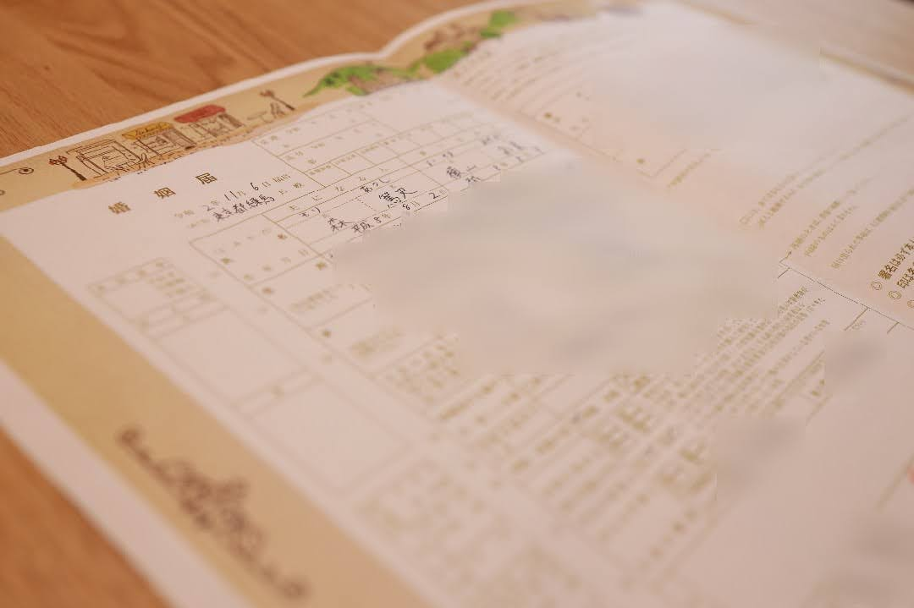
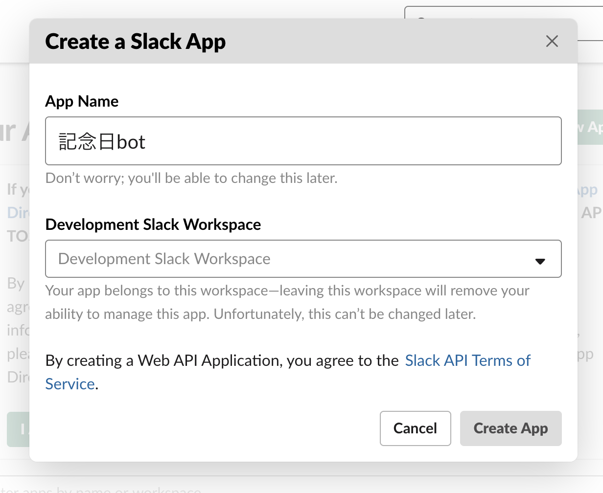
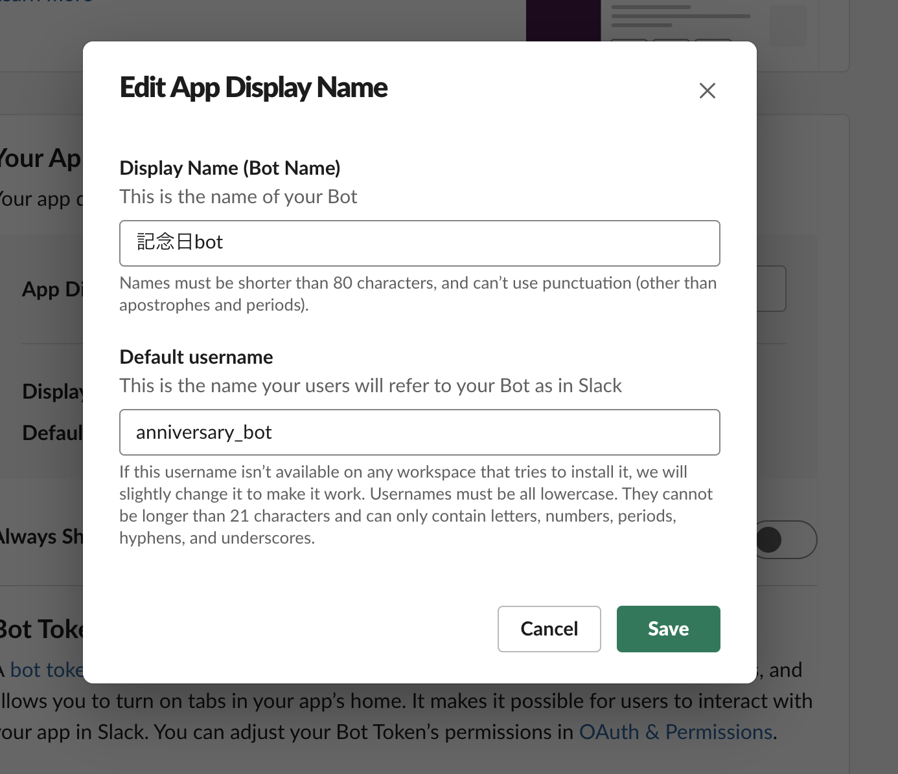
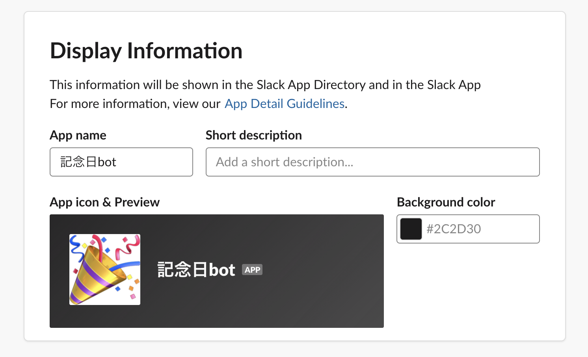
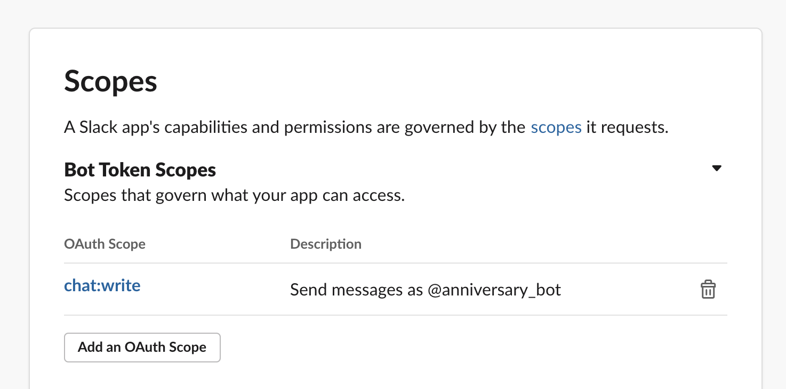
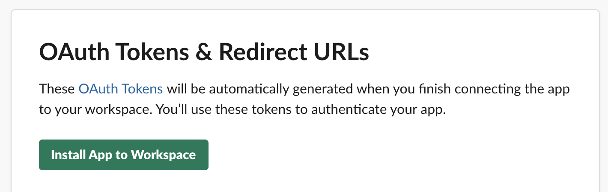
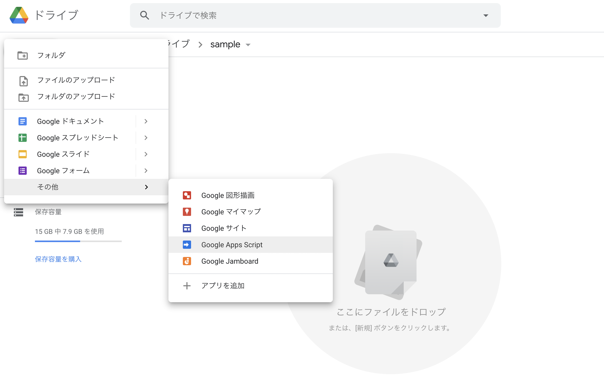
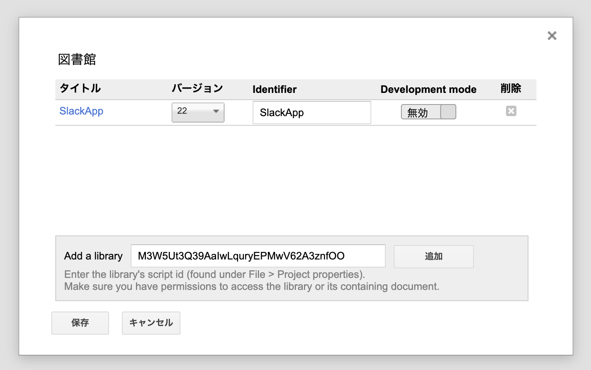
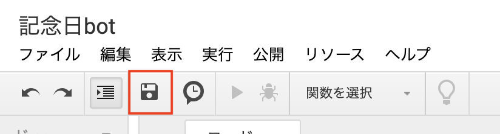
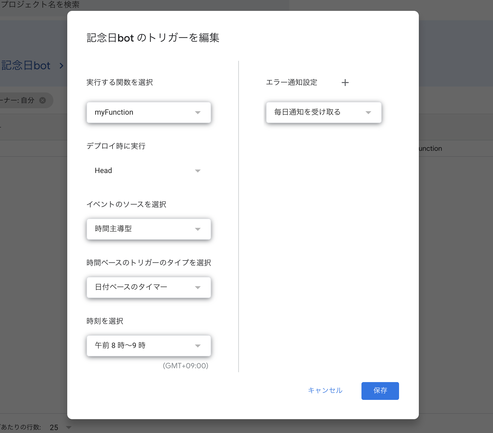

突然ですが、2020年11月6日に入籍しました。



結婚記念日やその他記念日を忘れると、怒られが発生するので、記念日当日にslackに通知してもらいましょう。

今回は[GAS(Google Apps Script)](https://developers.google.com/gsuite/aspects/appsscript?hl=ja)を使っていきます。

## 1. Slackの認証コードを発行
### 1.1. アプリケーションを作成
[ここ](https://api.slack.com/apps)  の `Create New App` から新規アプリケーションを作成します。



### 1.2. botの作成
`App Home` を選択し、 `App Display Name` を編集します。



その後、 `Basic Information` からアイコン画像とかを設定しておきましょう。



### 1.2. 権限の付与 / 認証

`OAuth & Permissions`  を選択し、 `Scopes` の `Bot Token Scopes` に `chat:write`を追加



その後、ページの一番上の `Install App to Workspace` をクリック。



権限が要求されるので、承認します	

そうすると、`Bot User OAuth Access Token` が発行されるので、コピーしておきましょう。

### 1.3. slackチャンネルへの招待
作成したbotを通知を送りたいチャンネルに招待しておきましょう。

## 2. GASのコードを書く
### 2.1. GASのファイル作成
[Google ドライブ](https://www.google.co.jp/drive/apps.html)の適当なディレクトリで新規作成からGoogle Apps Scriptを作成します。




プロジェクト名も設定しておきましょう。

### 2.2. ライブラリの追加
`リソース` の中の `ライブラリ` を選択し、 `M3W5Ut3Q39AaIwLquryEPMwV62A3znfOO` を追加します。



このライブラリは[こちら](https://qiita.com/soundTricker/items/43267609a870fc9c7453)で紹介されています。

### 2.3. コーディング
以下のコードを貼り付けます。

`anniversary` と `channel` , `token` は自身のものに変更してください。
```js
function myFunction() {
  var anniversary = new Date("2020/11/6"); // 記念日を入力
  var date = new Date();
  var days = ["日", "月", "火", "水", "木", "金", "土"];
  var today = date.getFullYear() + "年" + (date.getMonth() + 1) + "月" + date.getDate() + "日 (" + days[date.getDay()] + ")";
  var channel = "#general" // チャンネル名を入力
  var token = "xoxb-xxx...";  // 先程設定したBot User OAuth Access Tokenを貼り付け
  var slackApp = SlackApp.create(token);
  
  if(anniversary.getMonth() == date.getMonth() && anniversary.getDate() == date.getDate()) {
    // 年記念日
    yearDiff = date.getFullYear() - anniversary.getFullYear();
    message = today + " は *" + yearDiff + "年記念日* です。おめでとう！";
    slackApp.postMessage(channel, message, options);
  }
}
```

これで実行すると、その日がN年記念日であれば通知されるはずです。

記念日でなければ何も起こらないので注意してください。

### 2.4. 定期実行の設定
時計のマークを押して定期実行のタイミングを調整します。



以下は毎朝8時〜9時の間に通知するように設定してあります。



## おまけ
年記念日だけでなく、月記念日や100日記念日、ゾロ目記念日等も通知されるようにしています。

是非参考にしてみてください。
```js
function myFunction() {
  var anniversary = new Date("2013/11/8"); // 記念日を入力
  var date = new Date();
  var days = ["日", "月", "火", "水", "木", "金", "土"];
  var today = date.getFullYear() + "年" + (date.getMonth() + 1) + "月" + date.getDate() + "日 (" + days[date.getDay()] + ")";
  var channel = "#general" // チャンネル名を入力
  var token = "xoxb-xxx...";  // 先程設定したBot User OAuth Access Tokenを貼り付け
  var slackApp = SlackApp.create(token);
  
  if(anniversary.getMonth() == date.getMonth() && anniversary.getDate() == date.getDate()) {
    // 年記念日
    yearDiff = date.getFullYear() - anniversary.getFullYear();
    message = today + " は *" + yearDiff + "年記念日* です。おめでとう！";
    slackApp.postMessage(channel, message, options);
  } else if(anniversary.getDate() == date.getDate()) {
    // 月記念日    
    monthDiff = (date.getFullYear() - anniversary.getFullYear()) * 12 + date.getMonth() - anniversary.getMonth();
    message = today + " は *" + monthDiff + "ヶ月記念日* です。おめでとう！";
    slackApp.postMessage(channel, message, options);
  }

  // 日記念日
  dayDiff = Math.floor((date.getTime() - anniversary.getTime()) / (1000 * 60 * 60 * 24))
  if(dayDiff % 100 == 0 || isRepdigit(dayDiff)) {
    message = today + " は *" + dayDiff + "日記念日* です。おめでとう！";
    slackApp.postMessage(channel, message, options);
  }
  console.log(anniversary);
}

// ゾロ目判定
function isRepdigit(input) {
  var src = input.toString();
  var m = src.match(/^[0-9]/);
  if (m) {
    var re = new RegExp('^'+ m[0] +'{2,}$');
    return re.test(src);
  }
  return false;
}
```