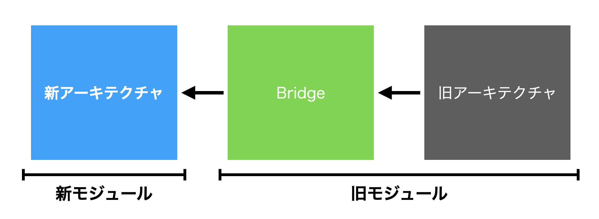
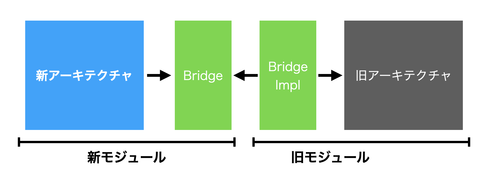

この記事は [CyberAgent Developers Advent Calendar 2020](https://adventar.org/calendars/5711)  の6日目の記事です。

ある程度の歴史の長いプロジェクトでは、リアーキテクチャやアーキテクチャのブラッシュアップ等により、複数のアーキテクチャが混ざるということが多々あると思います。

私もAndroidアプリにおいてMVCからMVVM、javaからkotlinへの段階的リアーキテクチャを進めています。

[全社2000人の技術者が選んだ「最優秀ベストルーキー」～「OPENREC.tvと未踏IT人材発掘・育成事業」の並行開発にチャレンジした1年間～ | FEATUReS サイバーエージェント公式オウンドメディア](https://www.cyberagent.co.jp/way/features/list/detail/id=24696)

その中で一番重要なのは、 **新アーキテクチャの実装/設計を旧アーキテクチャに依存させないこと** だと感じています。

今回は、それを実現するためのいくつかの工夫について紹介したいと思います。

## なぜ新アーキテクチャは旧アーキテクチャに依存しては行けないのか
「割れ窓理論」という言葉を聞いたことがあるでしょうか？


「建物の窓が壊れているのを放置すると、誰も注意を払っていないという象徴になり、やがて他の窓もまもなく全て壊される」([引用](https://ja.wikipedia.org/wiki/%E5%89%B2%E3%82%8C%E7%AA%93%E7%90%86%E8%AB%96))という考え方をもとに、軽微な問題も放置するべからず、という意味が込められています。

プログラミングの世界でも、好ましくないコードを少し許容した瞬間、その後どんどん汚染されていく経験を持つ人は多いでしょう。

特に、新アーキテクチャを導入しようとしているときは、些細な妥協も禁物だと思っています。

一度、旧アーキテクチャに依存したコードを許容すると、いつの間にかどんどん密に依存したコードになり、旧アーキテクチャをいつまでも消せなくなったりします。

また、設計に関しても、旧アーキテクチャに沿った設計に寄せていくと、当初予定した本来のアーキテクチャから離れていってしまいます。

理想の新アーキテクチャを実現するため、強い気持ちで、旧アーキテクチャに依存しない形で進めましょう。

## モジュールに切って依存関係を強制させる
単に新アーキテクチャでは旧アーキテクチャのコードを参照しないでくださいと言っても、なかなか難しいですし、どこかで妥協が生じてしまうものです。

Androidアプリ開発では、一つのプロジェクト内でコンパイル単位を分割することができる、Multi Moduleという仕組みがあります。

定義したモジュール間の依存関係は明示的に書く必要があり、循環した依存は定義できない（コンパイルが通らない）特徴があります。


この特徴使い、旧アーキテクチャをlegacyモジュール等に閉じ込め、新アーキテクチャからは参照できないようにします。


モジュールに切らない場合であっても、パッケージやディレクトリを使ってどこからを新でどこからを旧とするのかは、はっきりさせておくと良いでしょう。

しかし、互いのモジュールで参照したい内容も多くあると思うので、以下に方法と注意点について紹介します。

## 旧アーキテクチャから新アーキテクチャを呼ぶとき
旧アーキテクチャのモジュールから新アーキテクチャのモジュールは参照できるようにしておき、基本的に旧から新は直接呼び出します。

どんどん新アーキテクチャに移行し、必要に応じて旧アーキテクチャから呼び出すことで、部分的な移行も可能です。

問題になるのは、新アーキテクチャと旧アーキテクチャの差分をどこで吸収するかでしょう。

私は、Bridgeという吸収層を **旧モジュール内** に用意することで解決しています。



```kotlin
// 例：suspend functionをcallbackに変換する
class UserBridge(
    private val userRepository
) {
    fun getUser(id: String, callback: ResponseCallback<User>) {
        GlobalScope.launch {
            try {
                val user = userRepository.getUser(id).toLegacyModel()
                callback.onSuccess(user)
            } catch (e: Throwable) {
                callback.onFailure(e)
            }            
        }
    }
}
```

決して新モジュール内で解決しないように気をつけています。

新アーキテクチャと旧アーキテクチャでモデルが異なる場合も、旧モジュール内でマッピングを行います。

```kotlin
fun User.toLegacyModel(): LegacyUser {
    val legacyUser = LegacyUser()
    legacyUser.id = id
    ...
    return legacyUser
}
```

## 新アーキテクチャから旧アーキテクチャを呼ぶとき
新から旧の呼び出しは、可能な限り避け、そのような要求が発生する場所では基本的にまとめて新アーキテクチャに移行したいです。

しかしながら、どうしてもまとめて移行できない等、一時的にそのような呼び出しをする必要があるケースはあると思います。

そういった場合は、抽象に依存させることで、直接依存させない形で実現しています。

interfaceを **新モジュール** に置き、その実装は **旧モジュール** に置き、DI container等を使って配布します。


```kotlin
// 例: 新アーキテクチャからcallback関数を呼び出したい
interface UserBridge {
    suspend fun getUser(id: String): User
}
```
```kotlin
class UserBridgeImpl: UserBridge {
    override suspend fun getUser(id: String): User {
        return suspendCoroutine<User> { continuation ->
            val listener = object : ResponseCallback<LegacyUser> {
                override fun onSuccess(data: LegacyUser) {
                    continuation.resume(data.toModernModel())
                }

                override fun onFailure(e: Throwable) {
                    continuation.resumeWithException(e)
                }
            }
            LegacyUser.get(id, listener)
        }
    }
}
```

ここでもinterfaceはできる限り新アーキテクチャの設計に従った形にし、実装側で吸収をすることで、後から差し替えが容易になります。

## どうしても新アーキテクチャを変える場合
上記の解決方法を駆使すれば、概ね新アーキテクチャは理想の形を保って開発し続けられると思いますが、部分的に旧アーキテクチャに合わせて新アーキテクチャの設計を変えざる負えない場所はあると思います。

私のプロジェクトでは、BaseActivity等のUIの共通部や、新アーキテクチャと旧アーキテクチャのキャッシュの同期部分で発生しました。

その場合は、命名をわかりやすくした上で、Deprecatedタグを付けて対応しています。
```kotlin
interface UserRepository {
    suspend fun getUser(userId: String)

    @Deprecated(“Use only in legacy modules”)
    suspend fun legacyGetUser(legacyUserId: Long)
}
```

命名が被る場合は、新しい方を変えるのではなく、古い方にlegacyとつけてあげるのがわかりやすいと感じています。

## まとめ
段階的リアーキテクチャを行うにあって、私が普段気をつけていることについて紹介しました。

今回紹介した「新から旧への依存は許さない」「新アーキテクチャの設計は理想のみに従う」という原則のもと、実際の細かい実装や設計に関しては試行錯誤しながら取り組んでいます。

もし同じような取り組みをしている、しようとしている方がいれば、ぜひ一緒に議論しましょう…！