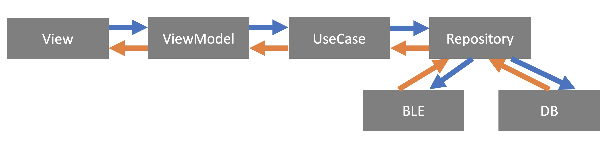

この記事は [CyberAgent 19新卒 エンジニア Advent Calendar 2018](https://adventar.org/calendars/3342) の24日目の記事です。

23日目はKatsuyaAkasakaくんによる [webRTCの世界 - Qiita](https://qiita.com/KatsuyaAkasaka/items/22b545b5630e7f74622b) でした。

CyberAgentの来年度新卒が頑張ってるので是非見てください。

## 概要
AndroidとiOSのアプリを両方開発するのはめんどくさいということで、react nativeやflutterといったマルチプラットフォームのフレームワークが充実してきています。

今回、flutter + MVVM + Clean Architecture + rxdart で簡単なAndroid、iOSアプリを開発したので、その際に気をつけた点等を共有しようと思います。

## 作ったもの
[GUGEN 2018](https://gugen.jp/) や [MA2018](https://ma2018.we-are-ma.jp/) のために  [にぎるくん](https://gugen.jp/entry2018/2018-098) を作りました。

<iframe width="560" height="315" src="https://www.youtube.com/embed/Eob8gxp4ctw" frameborder="0" allow="accelerometer; autoplay; encrypted-media; gyroscope; picture-in-picture" allowfullscreen></iframe>

僕はスマートフォンアプリ担当で、今回、技術的挑戦を含めflutterを使ってみました。

全体の概要は、にぎるくん本体から握力の情報をBLE経由で得て、握力の強さや握った回数を表示するというものです。


また、それらの情報はアプリ内のDBにも保存します。

全てのソースコードは以下に公開されています。（コンテストに向けてゴリゴリ書いたコードなので汚い部分も多いですがご了承ください）
* [GitHub - cyder/nigiru_kun_sp](https://github.com/cyder/nigiru_kun_sp)

## アーキテクチャ
MVVMとClean Architectureを使い、以下のような設計にしました。



今回はDI等は使わず、各層の中でひとつ下の層を実体化しています。

Repositoryがsingletonになっているので、この方法でも同じデータにアクセスすることができます。

以下、各層について少し説明します

### BLE、DB
今回、データソースがBLEとDBの2つありました。

BLEに関しては [flutter_blue](https://github.com/pauldemarco/flutter_blue)  を使っていますが、詳しくは、一緒に開発したchigichan24の [flutter_blueで両OS対応のSDKを書いてみる - Qiita](https://qiita.com/chigichan24/items/89cb686e880f0274ed1c) を読んでください。

また、DBに関しては  [sqflite](https://github.com/tekartik/sqflite) を使いました。

BLEのデータもDBのデータも基本rxdartで流しています。

### Repository
datasourceをwrapしています。

UseCaseから呼び出すときに、BLEから来てるデータなのか、DBのデータなのかを意識しなくていいようになっています。

また、BLEから来たデータをDBに保存する作業等もここの層で行いました。

### UseCase
ビジネスルールをここに書きます。

今回は、複数リポジトリからのデータを合わせたり、データを意味のある形に整形したりしました。

### ViewModel
Viewに必要なものをUseCaseから取り出します。

受け取った状態に合わせて一部文字列を変更したり、rxdartで流れてきたものをviewに通知してあげたりしています。

## View <—> ViewModel
ViewとViewModelの接続には、 [scoped_model](https://github.com/brianegan/scoped_model) を使っています。

使い方のイメージは以下です。

* lib/ui/widget/tabs/home_tab.dart（抜粋）
```dart
import 'package:flutter/material.dart';
import 'package:scoped_model/scoped_model.dart';
import 'package:nigiru_kun/viewmodels/home_tab_view_model.dart';

class HomeTab extends StatefulWidget {
  final HomeTabViewModel viewModel;

  HomeTab(this.viewModel);

  @override
  _HomeTabState createState() => _HomeTabState(viewModel);
}

class _HomeTabState extends State<HomeTab> {
  final HomeTabViewModel viewModel;

  _HomeTabState(this.viewModel);

  @override
  void initState() {
    super.initState();
    viewModel.init();
  }

  @override
  void dispose() {
    super.dispose();
    viewModel.dispose();
  }

  @override
  Widget build(BuildContext context) {
    return ScopedModel<HomeTabViewModel>(
      model: viewModel,
      child: ScopedModelDescendant<HomeTabViewModel>(
          builder: (context, child, model) => Text(
              // ここでViewModelにアクセス
              'Today ${model.today}',
              style: const TextStyle(fontSize: 28.0),
          )
    );
  }
}
```

* lib/viewmodels/home_tab_view_model.dart（抜粋）
```dart
import 'package:scoped_model/scoped_model.dart';
import 'package:nigiru_kun/usecases/count_use_case.dart';

class HomeTabViewModel extends Model {
  CountUseCase _countUseCase = CountUseCase();

  String get today {
    final today = DateTime.now();
    var formatter = DateFormat('yyyy.MM.dd');
    return formatter.format(today);
  }

  void init() {}

  void dispose() {}
}
```

これだけみると、冗長な感じがしますが、子widget、孫widgetに、意識的にmodelを渡してあげなくても同じmodelにアクセスすることができます。

* lib/ui/widget/tabs/home_tab.dart（抜粋・改）
```dart
...
  @override
  Widget build(BuildContext context) {
    return ScopedModel<HomeTabViewModel>(
      model: viewModel,
      child: HomeCounter() // 子widgetを呼ぶ
    );
...
```

* nigiru_kun_sp/lib/ui/widget/tabs/home_tab/home_counter.dart（抜粋・改）
```dart
import 'package:flutter/material.dart';
import 'package:scoped_model/scoped_model.dart';
import 'package:nigiru_kun/viewmodels/home_tab_view_model.dart';

class HomeCounter extends StatelessWidget {
  @override
  Widget build(BuildContext context) {
    return ScopedModelDescendant<HomeTabViewModel>(
        builder: (context, child, model) => Text(
              // ここでViewModelにアクセス
				'Today ${model.today}',
				style: const TextStyle(fontSize: 28.0),
        ),
    )
  }
}
```

viewModelで状態を変更したら `notifyListeners();` を忘れずに呼ぶようにしてください。

## Dialog問題
MVVMをやっていると必ず迎えるのがDialogの問題です。

Dialogを表示させるためには、Viewが持っているcontextが必要になるわけですが、ViewModelからViewのメソッドを叩くことは依存の方向が逆になってしまうので、できません。

contextをViewModelに渡してあげる方法もありますが、さすがにViewModelがViewを知りすぎていることになるのであまりやりたくありません。

今回はrxでViewModelからstreamを流してあげ、それが流れてきたらdialogを表示させたり閉じたりするようにしました。

ベストな方法ではないと思いますが、参考までに。

*  lib/viewmodels/bluetooth_view_model.dart（抜粋）
```dart
import 'package:scoped_model/scoped_model.dart';
import 'package:rxdart/rxdart.dart';

enum DialogType {
  Select,
  Error,
  Close,
}

class BluetoothViewModel extends Model {
  PublishSubject<DialogType> _currentDialog = PublishSubject<DialogType>();

  PublishSubject<DialogType> get currentDialog => _currentDialog;

  void search() {
    // ここでdialogを表示
    _currentDialog.add(DialogType.Select);
    notifyListeners();
  }
}
```

* lib/ui/pages/bluetooth.dart（抜粋）
```dart
...
  @override
  void initState() {
    super.initState();
    viewModel.init();
    viewModel.currentDialog.listen((data) {
      if (data == DialogType.Close) {
        Navigator.of(context).pop();
        return;
      }

      showDialog(
          context: context,
          builder: (BuildContext context) {
            // typeに合わせてdialogを表示
            switch (data) {
              case DialogType.Select:
                return _selectDialog(model);
              case DialogType.Error:
                return ErrorDialog(
                  title: 'エラー',
                  content: '予期せぬエラーが発生しました。',
                  buttonColor: CustomColors.primaryColor,
                );
              case DialogType.Close:
                return null;
            }
          });
    });
  }
...
```


## まとめ
3週間という超短期的な開発でしたが、冗長性のあるアーキテクチャを採用することで、記述量は増えつつも確実に動くものが作れたと感じています。

どこに何を書けばよいのかがはっきりしていたことと、どこの層までを誰が担当するのかを明確化できたのも良かった点でした。

一方、少し雑に書いてあるところもあり、UseCase以下に書くべきなロジックがViewModelに残っていたり、UseCaseとRepositoryの役割が曖昧になっている点があるので、そのあたりを見直していきたいと思っています。

flutterに関して言えば、flutter自体はすごくよく作られているのですが、dartに思うような仕様がなかったり、周辺ライブラリなどが充実していない等、苦労されられることも多かったです。

今回のぐらいの簡単なUI、ロジックであればflutter等、マルチプラットフォームのフレームワークを採用するのはありかもしれませんが、複雑化することがわかっているのであれば、現状ネイティブで書いたほうが明らかにいいと改めて感じました。

ちなみに、GUGEN 2018では、チームラボ様から賞も頂きました。ありがとうございました。

