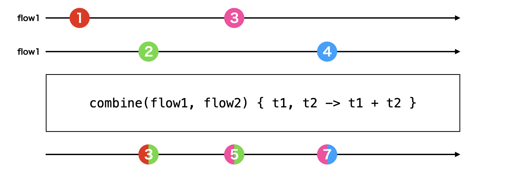
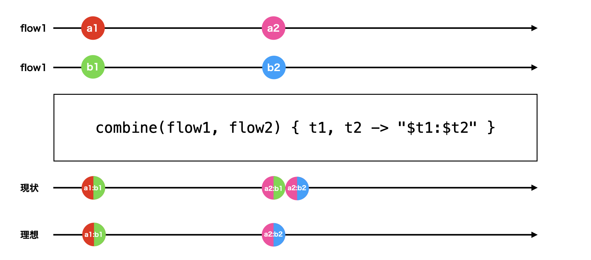

Kotlin CoroutinesのFlowを使っている場合、UI状態の統合等で[Flow.combine](https://kotlinlang.org/api/kotlinx.coroutines/kotlinx-coroutines-core/kotlinx.coroutines.flow/combine.html)を使うことが多いと思います。

Kotlin CoroutinesはOSSになっており、その実装を簡単に読むことができます。

`Flow.combine`はどうやって実装されているのか気になり、読んでみると、思った以上に細かいところに気を配った丁寧な実装になっていて驚きました。

今回はその`Flow.combine`の実装を自分で再現するという流れで、公式の`Flow.combine`の工夫されている点や、複雑なFlowを自作する方法について学びたいと思います。

## `Flow.combine`の動作
`Flow.combine`は2つ以上のFlowから値を受け取り、それらの値を組み合わせて新しい値を作成するFlowを作ります。

例えば、flow1とflow2の値の合計を出力するFlowは以下のように作れます。

```kotlin
val outputFlow = flow1.combine(flow2) { t1, t2 ->
    t1 + t2
}
```

上記は、以下のように書くこともできます。

```kotlin
val outputFlow = combine(flow1, flow2) { t1, t2 ->
    t1 + t2
}
```

いずれかのFlowが更新されると、それぞれのFlowの最新の値をもとに新しい値が再計算されます。

すべてのFlowの最初の値が用意されるまで、値が流れないことにも注意してください。

図にすると、以下のようになります。



他に複数のFlowを組み合わせるものに、[zip](https://kotlinlang.org/api/kotlinx.coroutines/kotlinx-coroutines-core/kotlinx.coroutines.flow/zip.html)や[merge](https://kotlinlang.org/api/kotlinx.coroutines/kotlinx-coroutines-core/kotlinx.coroutines.flow/merge.html)というものもあるので、混合しないように注意してください。

## 簡単な実装
この`Flow.combine`を自分で実装してみましょう。

簡単な実装方法として、以下のようなコードが浮かぶと思います。

```kotlin
fun <T1, T2, R> combine(
    flow: Flow<T1>,
    flow2: Flow<T2>,
    transform: suspend (a: T1, b: T2) -> R
): Flow<R> = combine(arrayOf(flow, flow2)) {
    @Suppress("UNCHECKED_CAST")
    transform(it[0] as T1, it[1] as T2)
}

inline fun <T, R> combine(
    flows: Array<Flow<T>>,
    crossinline transform: suspend (Array<T>) -> R
): Flow<R> = channelFlow {
    val size = flows.size
    val latestValues = Array(size) { UNINITIALIZED }

    flows.forEachIndexed { index, flow ->
        launch {
            flow.collect { value ->
                latestValues[index] = value
                if (latestValues.all { it != UNINITIALIZED }) {
                    @Suppress("UNCHECKED_CAST")
                    send(transform(latestValues as Array<T>))
                }
                yield()  // 各Flowが`emit`する機会を与える
            }
        }
    }
}

private object UNINITIALIZED
```

順番に解説していきます。

今回用意するのは２つのFlowを統合するためのオペレーターですが、より多くのFlowにも対応できるよう、Flowを`Array`の中に入れて一般化します。

```kotlin
fun <T1, T2, R> combine(
    flow: Flow<T1>,
    flow2: Flow<T2>,
    transform: suspend (a: T1, b: T2) -> R
): Flow<R> = combine(arrayOf(flow, flow2)) {
    @Suppress("UNCHECKED_CAST")
    transform(it[0] as T1, it[1] as T2)
}
```

すべてのFlowを監視し、`latestValues`に最新の値を格納していきます。

```kotlin
inline fun <T, R> combine(
    flows: Array<Flow<T>>,
    crossinline transform: suspend (Array<T>) -> R
): Flow<R> = channelFlow {
    val size = flows.size
    val latestValues = Array(size) { UNINITIALIZED }

    flows.forEachIndexed { index, flow ->
        launch {
            flow.collect { value ->
                latestValues[index] = value
                /* ... */
            }
        }
    }
}
```

初期状態として、`UNINITIALIZED` というオブジェクトを用意しています。

`null`を使わないのは`Flow`の値として`null`を使うこともできるので、それと初期状態を区別するためです。

他に考えられる方法として、以下のように `Holder` クラスを用意することで `null` と初期状態を区別することができます。

```kotlin
class Holder<T : Any?>(val value: T)

val uninitialized: Holder<Int?>? = null
val initializedNull: Holder<Int?>? = Holder(null)
val initializedInt: Holder<Int?>? = Holder(1)
```

こちらの方が型安全になりますが、クラスの生成はコストがかかることがあるので`Any?`を使うことがあります。

すべての初期値が決定されたタイミング、すなわち`latestValues`のすべての値が`UNINITIALIZED`でなくなったタイミングから出力の`Flow`に値を排出していきます。

```kotlin
flow.collect { value ->
    latestValues[index] = value
    if (latestValues.all { it != UNINITIALIZED }) {
        @Suppress("UNCHECKED_CAST")
        send(transform(latestValues as Array<T>))
    }
    yield()  // 各Flowが`emit`する機会を与える
}
```

Flowの`collect`内部で[yield](https://kotlinlang.org/api/kotlinx.coroutines/kotlinx-coroutines-core/kotlinx.coroutines/yield.html)を呼び出しているのは他のFlowが`emit`する機会を担保するためです。

[Dispatchers.Main](https://kotlinlang.org/api/kotlinx.coroutines/kotlinx-coroutines-core/kotlinx.coroutines/-dispatchers/-main.html)等の単一スレッドのディスパッチャーを使っている場合、一つのFlowが連続で値を`emit`しているとそのFlowのみが連続して処理され、他のFlowの値を受け取れないという問題が発生します。

それを防ぐため、`yield`を呼び出すことで他の`Flow`に処理を譲ることができます。

複数のCoroutinesを起動し、その中でFlowを出力する場合は[flow](https://kotlinlang.org/api/kotlinx.coroutines/kotlinx-coroutines-core/kotlinx.coroutines.flow/flow.html)の代わりに[channelFlow](https://kotlinlang.org/api/kotlinx.coroutines/kotlinx-coroutines-core/kotlinx.coroutines.flow/channel-flow.html)を使う必要があることに注意してください。

## スレッドセーフにする
上記のコードはだいたい期待通りに動作しますが、[Dispatchers.Default](https://kotlinlang.org/api/kotlinx.coroutines/kotlinx-coroutines-core/kotlinx.coroutines/-dispatchers/-default.html)等の複数スレッドを利用できるDispatcherを使うと、競合状態が発生することがあります。

`Dispatchers.Default`等を使うと、`Flow`を監視するために起動しているCoroutinesが別スレッドで起動されます。

その際、複数スレッドで `latestValues`を共有して読み取り及び書き込みを行うことになるため、不整合な状態が生まれる可能性があります。

解決には[Mutex](https://kotlinlang.org/api/kotlinx.coroutines/kotlinx-coroutines-core/kotlinx.coroutines.sync/-mutex/)を使うなどいくつか方法がありますが、今回は[Channel](https://kotlinlang.org/api/kotlinx.coroutines/kotlinx-coroutines-core/kotlinx.coroutines.channels/-channel/)を使う方法を紹介します。

すべてのFlowのイベントを集める`resultChannel`を用意し、そのChannel経由でのみ出力Flowの作成を行います。

```kotlin
inline fun <T, R> combine(
    flows: Array<Flow<T>>,
    crossinline transform: suspend (Array<T>) -> R
): Flow<R> = flow {
    val size = flows.size
    val latestValues = Array(size) { UNINITIALIZED }
    val resultChannel = Channel<IndexedValue<T>>()

    coroutineScope {
        flows.forEachIndexed { index, flow ->
            launch {
                flow.collect { value ->
                    resultChannel.send(IndexedValue(index, value))
                    yield() // 各Flowが`emit`する機会を与える
                }
            }
        }

        for (element in resultChannel) {
            latestValues[element.index] = element.value
            if (latestValues.all { it != UNINITIALIZED }) {
                @Suppress("UNCHECKED_CAST")
                emit(transform(latestValues as Array<T>))
            }
        }
    }
}
```

こうすることで、`latestValues`の読み書きや出力Flowへの排出を単一スレッドで安全に行うことができるようになります。

出力Flowへの排出が既存のCoroutine Scope内になったため、`channelFlow`ではなく`flow`に変更しています。

スレッド競合については以前書いた「[Kotlin Coroutinesで共有リソースを扱う](https://at-sushi.work/blog/44/)」も確認してみてください。

## Flowのcloseに対応する
Flowはすべてのイベントを排出したタイミングでストリームをcloseすることができます。

公式の`Flow.combine`では、監視しているすべての`Flow`が閉じたタイミングで出力のFlowも閉じるようになっています。

これを実装してみましょう。

```kotlin
inline fun <T, R> combine(
    flows: Array<Flow<T>>,
    crossinline transform: suspend (Array<T>) -> R
): Flow<R> = flow {
    val size = flows.size
    val latestValues = Array(size) { UNINITIALIZED }
    val resultChannel = Channel<IndexedValue<T>>()
    val nonClosed = AtomicInteger(size)

    coroutineScope {
        flows.forEachIndexed { index, flow ->
            launch {
                try {
                    flow.collect { value ->
                        resultChannel.send(IndexedValue(index, value))
                        yield() // 各Flowが`emit`する機会を与える
                    }
                } finally {
                    // Flowが一つも残っていなければチャンネルを閉じる
                    if (nonClosed.decrementAndGet() == 0) {
                        resultChannel.close()
                    }
                }
            }
        }

        for (element in resultChannel) {
            /* ... */
        }
    }
}
```

Flowを`collect`している場所を`try-finally`で囲って、終了時に`nonClosed`をデクリメントしていきます。

すべてのFlowがcloseされると、`nonClosed`も0になるので、その時チャンネルもcloseします。

チャンネルがcloseされると、 `element in resultChannel`の箇所を抜け、出力Flowも終了します。

先程も言った通り、ここは複数スレッドで呼び出される可能性があるため、`AtomicInteger`等を使ってスレッドセーフにする必要があります。

`AtomicInteger`はJVMでしか使えないため、公式の`Flow.combine`では`kotlinx.atomicfu`が使われていました。
## 不要な出力を減らす
複数のFlowにほぼ同時に出力があった場合に、何度も変換処理が実行されるのは無駄が多いと言えます。

例えば、以下のように２つのFlowを同時に編集しようとしたとします。

```kotlin
val flow1 = MutableStateFlow("a1")
val flow2 = MutableStateFlow("b1")

launch {
    combine(flow1, flow2) { t1, t2 -> "$t1:$t2" }
        .collect { println(it) }
}

launch {
    delay(100)
    flow1.value = "a2"
    flow2.value = "b2"
}
```

この際、上記の実装だと以下のように出力されます。

```text
a1:b1
a2:b1
a2:b2
```

ただし、`a2:b1`という出力は実際にはほとんど必要なく、スキップしてくれると理想的と言えるでしょう。

```text
a1:b1
a2:b2
```

図に書き表すと、以下のようになります。



公式の`Flow.combine`では複数のFlowで同時に値が流れたときは、最新の値でのみ変換処理が行われるように制御されています。

この動きを再現してみたいと思います。

```kotlin
inline fun <T, R> combine(
    flows: Array<Flow<T>>,
    crossinline transform: suspend (Array<T>) -> R
): Flow<R> = flow {
    val size = flows.size
    val latestValues = Array(size) { UNINITIALIZED }
    val resultChannel = Channel<IndexedValue<T>>(size)
    val nonClosed = AtomicInteger(size)

    coroutineScope {
        flows.forEachIndexed { index, flow ->
            launch { /* ... */ }
        }

        while (true) {
            // チャンネルが閉じられていたら、何もせずに終了する
            var element = resultChannel.receiveCatching().getOrNull() ?: break
            while (true) {
                val index = element.index
                latestValues[index] = element.value
                element = resultChannel.tryReceive().getOrNull() ?: break
            }

            if (latestValues.all { it != UNINITIALIZED }) {
                @Suppress("UNCHECKED_CAST")
                emit(transform(latestValues as Array<T>))
            }
        }
    }
}
```

１つ目のループで[Channel.receiveCatching](https://kotlinlang.org/api/kotlinx.coroutines/kotlinx-coroutines-core/kotlinx.coroutines.channels/-receive-channel/receive-catching.html)を使って、チャンネルのイベントを待機します。

チャンネルがクローズされていたら、[getOrNull](https://kotlinlang.org/api/kotlinx.coroutines/kotlinx-coroutines-core/kotlinx.coroutines.channels/-channel-result/get-or-null.html)の結果がnullになるので、そのままループを抜けて終了します。

その後、２つ目のループを起動し、その中で[Channel.tryReceive](https://kotlinlang.org/api/kotlinx.coroutines/kotlinx-coroutines-core/kotlinx.coroutines.channels/-receive-channel/try-receive.html)を使ってさらにイベントを受け取っていきます。

`Channel.tryReceive`はsuspend functionではなく通常の関数になっており、バッファに溜まっているイベントのみが取得できます。

もう溜まっているイベントがないか、チャンネルがクローズされている時に`getOrNull`が`null`を返すので、そのタイミングでループを抜けて変換の処理を行います。

これを使うことで、同時に来たイベントを一度に処理することができます。

`Channel.tryReceive`を使うには、チャンネルのバッファを指定する必要があることに注意してください。

各Flowの結果を同時に受け取れるよう、チャンネルのバッファにはFlowの数を指定しています。

ちなみに[Dispatchers.Main.immediate](https://kotlinlang.org/api/kotlinx.coroutines/kotlinx-coroutines-core/kotlinx.coroutines/-main-coroutine-dispatcher/immediate.html)を使った場合は、それぞれのFlowが即座に処理されるため、結果が異なることに注意してください。
## まとめ
`Flow.combine`の実装方法について紹介していきました。

今回は主要部分を紹介するために一部を抜粋しているので、実際のコードは以下を見てください。

* [kotlinx.coroutines/kotlinx-coroutines-core/common/src/flow/internal/Combine.kt](https://github.com/Kotlin/kotlinx.coroutines/blob/1.7.3/kotlinx-coroutines-core/common/src/flow/internal/Combine.kt)

今回紹介した内容に加え、公式のコードには以下のような要素が含まれています。

* [combineTransform](https://kotlinlang.org/api/kotlinx.coroutines/kotlinx-coroutines-core/kotlinx.coroutines.flow/combine-transform.html)と共通化
* sourceのFlowのキャンセルを伝播させる
* 同じFlowから連続した値を受け取ったらすぐに処理する
* 細かいパフォーマンス改善
  * `Array(size) { UNINITIALIZED }`の代わりに`fill(UNINITIALIZED)`を使う
  * `remainingAbsentValues`を使ってループ処理を減らす

今回`Flow.combine`の実装を読んで再現することで、スレッド安全にしたり、同時に発生したイベントをまとめて処理するために、Channelが有効であることを学ぶことができました。

また、パフォーマンスを改善するためのハックについても知ることができました。

これらを応用することで、複雑なFlowを扱うオペレータを自作する際に役立つと考えています。

すでに公式ライブラリ等で提供されているものを、改めて自分で作り直すことは「車輪の再開発」とも呼ばれ、あまり良くないとされています。

ただし、こうやって改めて自分の手を動かして書いてみることで、得られる学びは大きいと考えています。

実際にコードで利用しないことが条件ですが、ぜひとも色んな内部コードを読んで、手を動かして試してみてほしいと思います。