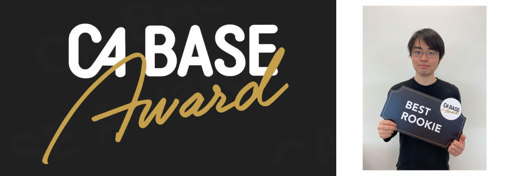
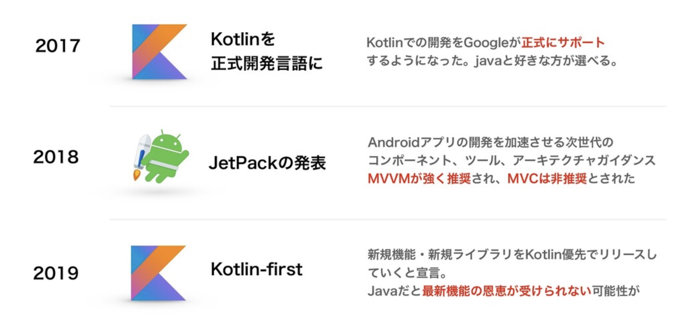
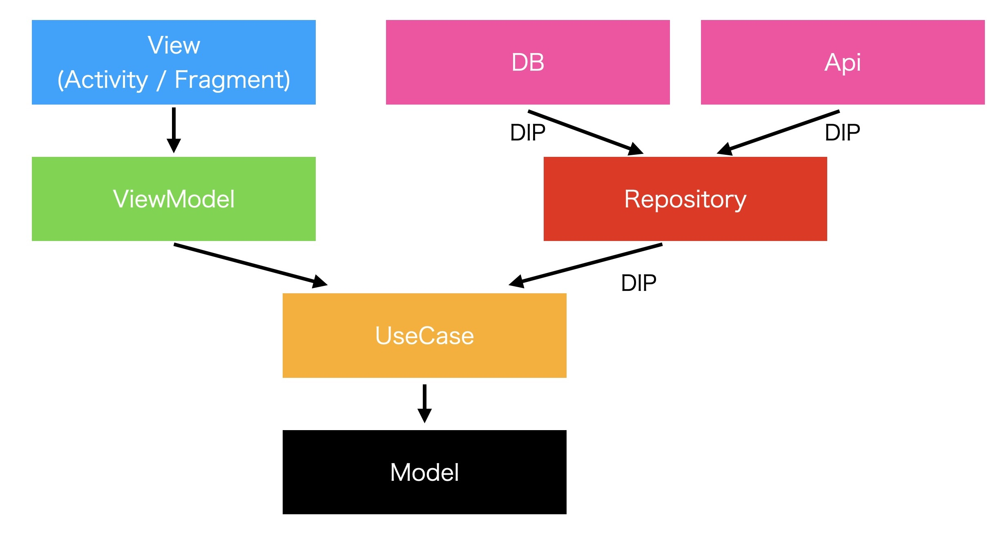
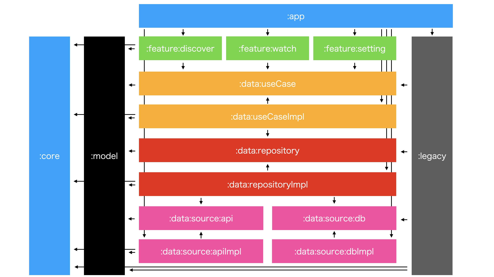
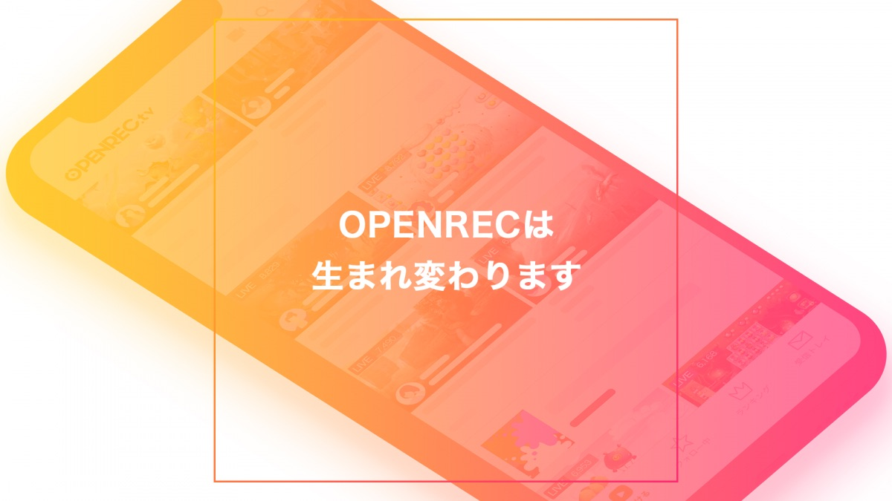

CyberAgentにエンジニアとして新卒入社して1年が経ちました。

僕は今、 [OPENREC.tv ](https://www.openrec.tv/) のAndroidアプリ開発を担当しています。

この1年、kotlinを導入したり、MVCからMVVMにリアーキテクチャしたり、デザインリニューアルをリリースしたりと、非常に忙しく動き回っていました。

そして非常にありがたいことに、技術者による技術者のための社内表彰「CA BASE AWARD 2020」において、ベストルーキー賞を頂きました。

一方で、僕が何をやっていたのか、多くの人はあまり知らないと思い、また今後自分が見返すためにも、この1年間やってきたことをまとめたいともいます。

## リアーキテクチャ
### 背景
OPENREC.tvのAndroidアプリは2015年にリリースされ、以後5年間大きく設計の変更等を行わずに運用されてきました。

そのため、Java100%、MVC、Callbackが多用されているという昔ながらの設計のままになっていました。

一方、androidの業界は以下の通り、大きく変化をしてきました。

このまま設計を変えずに開発を続けると、プラットフォーマーのgoogleに従わず開発を進めるわけで、非常に開発しづらく、ビジネス的な影響も起こし得ないと考えました。

そこで、大幅なリアーキテクチャを強く希望し、配属後最初の仕事としてこれを任せてもらうことになりました。

手を上げればどんだけ若くてもやらせてくれる、そういった社風の顕著な例だと思います。

### MVC -> MVVM + Clean Architecture
基本的には、googleの[アプリのアーキテクチャ ガイド](https://developer.android.com/jetpack/docs/guide?hl=ja)に従い、[JetPack](https://developer.android.com/jetpack?hl=ja) を用いたMVVMを採用しました。

また、Modelの設計は[Clean Architecture](https://blog.cleancoder.com/uncle-bob/2012/08/13/the-clean-architecture.html)を参考に、interfaceに依存させたlayered architectureを作成しました。

### Android Multi Module
今回、依存方向を強制させるためにandroid multi moduleを採用しています。

今までのjavaで書かれたlegacy moduleから新しいmoduleを参照できないようにしたり、layered architectureのlayer間の依存を細かく定義しました。

詳しい説明はこちらのスライドに記載されています -> [マルチモジュールでandroidアプリを救う | Scramble Tech #0](https://speakerdeck.com/moriatsushi/marutimoziyurudeandroidapuriwojiu-u-scramble-tech-number-0)

### 結果
今回、フルスクラッチではなく、段階的なアーキテクチャ移行を採用しました。

そのため、同時にlegacy moduleと新moduleを触ることになるのですが、圧倒的な差を感じます。

一番大きな点は、javaとkotlinの違いです。

null checkを始めとしてkotlinはやりたいことを完結に書けるので、重要なロジックに集中することが出来ます。

また今回、ドメインモデルをAPIのモデルをそのまま使うのではなく、Android独自で保持するようにしました。

全てのmodelでmapperを書く必要があり、面倒くささはありますが、外界の変化に強いシステムを構築することが出来ました。

もう一つ重要なのが、テスタビリティの向上です。

各layerが完全に独立してるため、各々のlayerで単体テストを書くことが出来、品質の向上に役立っています。

## 最新ライブラリの導入と所感
今回、architectureの移行に伴い、様々なライブラリの導入を行いました。

いくつか所感ともに紹介したいと思います。

### androidx化
Androidは2018年にライブラリの整理を行っており、[androidx](https://developer.android.com/jetpack/androidx?hl=ja) というパッケージ群で統一されています。

OPENRECはまだ対応出来ていなかったので、このタイミングで移行することにしました。

androidのライブラリは頻繁に更新されるので対応し続けるのは結構大変ですが、便利で安心なAPIを提供し続けてくれるので、こまめな更新が大事だなと感じています。

### kotlin coroutines flow / channel
実装を進めていく上で、webscoketで流れてくるチャット等、stream的に扱わないといけないデータが存在することがわかりました。

[RxJava](https://github.com/ReactiveX/RxJava) の導入も検討しましたが、せっかくなのでkotlin coroutinesの[Flow](https://kotlin.github.io/kotlinx.coroutines/kotlinx-coroutines-core/kotlinx.coroutines.flow/-flow/)  / [Channels](https://kotlinlang.org/docs/reference/coroutines/channels.html)に挑戦することにしました。

まだまだexperimentalなAPIも残っており、(5月段階では)決して導入事例も多くなかったですが、将来性を見込んでのproduction採用でした。

結果的には、RxJavaよりもシンプルで使いやすいと感じています。

特にhot streamとcold streamがchannelとflowで明確に分かれているのは、最初は少し戸惑いますが、慣れればむしろ納得感があります。

lifecycleとの対応も最近充実してるので、今後更に活躍の領域を広げるのでは無いでしょうか。

### Koin
layered architectureを実装する上でもはや必須になってるのがDI Containerです。

googleは[dagger](https://github.com/google/dagger)を最も推奨してるようですが、個人的に扱いきれる自信がなかったのでより軽量な[Koin](https://github.com/InsertKoinIO/koin)を採用しました。

書き方がわかりやすく、また必要十分な機能があるため、概ね問題なく使えています。

また、javaへのinjectionもサポートしてるのが高評価です。

一方で、パラメータの指定やscopeの指定等が型安全でなく、またテストコードも書きにくいため、その点では不満を感じています。

### Epoxy
RecyclerViewのViewHolderは今まで一つずつ定義していましたが、ボイラープレートコードの削減、また差分検知アルゴリズムの利用のために[Epoxy](https://github.com/airbnb/epoxy)を導入することにしました。

[Data Binding Support ](https://github.com/airbnb/epoxy/wiki/Data-Binding-Support)によって、コードをほとんど書かずに複雑なlayerを組んでいけるのは非常に助かっています。

一方で、差分検知に欠かせない[DoNotHash](https://github.com/airbnb/epoxy/wiki/DoNotHash)の仕組みは少し複雑で、僕もハマったので注意が必要かもしれません。

### retrofit / okhttp
APIを叩く部分をHttpURLConnectionから[retrofit](https://github.com/square/retrofit) + [okhttp](https://github.com/square/okhttp)への移行を進めています。

retrofitは標準でcoroutines scopeをサポートしており、okhttpは拡張性に優れ、非常に使いやすいです。

### Room
live配信サービスということで、localで保持しているデータはさほど多くなかったですが、一部SQLiteを使っていました。

そのOR Mapperに[SQLiteDatabase](https://developer.android.com/reference/android/database/sqlite/SQLiteDatabase)を使っていたので、ゴリッと[Room](https://developer.android.com/jetpack/androidx/releases/room?hl=ja)に載せ変えました。

こちらもボイラープレートコードが減ってコードの見通しがよくなったと思います。

一方、非常に多機能のため、依存しすぎないように注意する必要があるなと感じています。

## 開発体験の向上
その他、開発に関わる様々なタスクを自動化したりしました。

### CI
このタイミングに合わせて、CIの構築も行いました。

iOSチームが既に[Bitrise](https://www.bitrise.io/)を導入していたため、それに乗っかる形で導入しました。

今は、PR毎にbuildと各種testが走り、マージされたタイミングで[DeployGate](https://deploygate.com/?locale=ja)にアップロードされるようになっています。

また、tagを作成すると、release buildが焼かれ、こちらもDeployGateにアップロードされます。

### テストコード
テストコードもまだない状態だったので、一通りの環境を整えました。

[JUnit4](https://junit.org/junit4/) / [Robolectric](http://robolectric.org/) / [Truth](https://github.com/google/truth) / [Mockk](https://github.com/mockk/mockk) の一通りのライブラリを追加し、単体テストは書けるようになっています。

一方、まだUI Testは実施できていません。

coverageは[JaCoCo](https://www.eclemma.org/jacoco/)を使い、CIで計測して[Codecov](https://codecov.io/)で見れるようにしています。

JaCoCoでのcoverageはkotlinのinline methodに対応していなかったり、multi moduleでmoduleをまたぐようなテストは計測できませんが、あくまで目安程度で測定しています。

今期はUseCase層(ビジネスロジック部)に関してcoverage 50%を目標とし、無事53%を達成することができました。（新アーキテクチャのみ）

他のLayerに関して数値目標は置かない予定ですが、随時上げていきたいと思っています。

### 静的解析ツール
[Android Lint](https://developer.android.com/studio/write/lint?hl=ja) / [Ktlint](https://github.com/pinterest/ktlint)だけでなく、途中からより高度な静的解析を行ってくれる[detekt](https://github.com/arturbosch/detekt)も導入しました。

また、これらを[danger](https://github.com/danger/danger)を使ってPRに自動コメントしています。

本来人間がチェックするべきでないレイアウト崩れや大きすぎるメソッド等を事前にチェックしてくれるので、コードレビュー、そして品質担保の面で助かっています。

一方で、detektはデフォルトだと非常に厳しかったり、android開発に向いていなかったりするルールがあったりするので、随時チーム内で議論しつつ調整しています。

### デバッグツール
今まで、自作デバッグツールがあったのですが、[Hyperion-Android](https://github.com/willowtreeapps/Hyperion-Android)というのが非常に便利だったので、そちらと統合しました。

よく使うのは、hyperion-attrやhyperion-measurementでレイアウトを確認したり、httpログが見える[chuck](https://github.com/jgilfelt/chuck)と連携させています。

[Hyperion-Simple-Item](https://github.com/takahirom/Hyperion-Simple-Item)を使って独自メニューも追加しており、以前のデバッグメニューであったり、dark / lightモードを切り替えられるようになったりしています。

## 機能面
機能面に関しては、リリースされてないもの等言及できないものも多くあるのですが、既に公開されているものを以下に少し並べたいと思います。

### デザインリニューアル
OPENRECは2019年12月に[デザインリニューアル](https://article.openrec.tv/6719)を行いました。

全画面に渡ってカラー等の調整が入った他、dark / whiteモードの対応を行いました。

Darkモードに関してはresourceに-nightをつけるものとつけないものを用意するだけで、比較的簡単に実装することが出来た一方、既存画面を漏れなく変更するのは結構難しかったです。

### 横画面対応
今まで、横画面はタブレットのみ許可していましたが、意図的にスマホだけで回転制限を書けるのに無理が生じていたので、スマホでの横画面の対応も行いました。

ところどころ細かいUI調整が必要でしたが、-sw resourceだけでなく -w resource / -h resourceをうまく使い分けることで柔軟なレイアウトを作成することが出来ました。

今後、フォルダブルなスマホが増えてくるのであれば、よりフレキシブルなlayoutの構築が重要になりそうな気がします。

### 動画アップロード
この度、Androidアプリからの動画アップロードに対応しました [リリース情報](https://openrec.zendesk.com/hc/ja/articles/360041811811-%E3%83%AA%E3%83%AA%E3%83%BC%E3%82%B9%E6%83%85%E5%A0%B1-2020-4-2-%E8%A6%96%E8%81%B4%E5%B1%A5%E6%AD%B4-Android%E3%81%8B%E3%82%89%E3%81%AE%E5%8B%95%E7%94%BB%E6%8A%95%E7%A8%BF)

僕はアップロード機構を担当しました。（実は編集画面とかのほうがビジネスロジックが入り込む分大変です）

初めてserviceとnotificationsを使い、アップロード状況の通知にflowをゴリゴリ使ったシステムを構築したので、少し面白かったです。

## もっと大切なこと
色々技術的な改善等を書きましたが、大きな仕事だったのがコミュニケーションです。

リアーキテクチャを遂行するにあたって、一番大切だったのはチーム内でどうしてこういう設計を採用したのか共有することでした。

特に、各Layerに何を書いたらいいかという問題は、今でも常に議論しています。

また、タスクの分担、仕様のすり合わせ、お問い合わせ対応など、サーバサイド、他プラットフォーム等も含めた様々な方と連携しなければ、一歩も動けない現実を知りました。

[Team Geek](https://www.oreilly.co.jp/books/9784873116303/)で言及されている[HRT](https://juristr.com/blog/2012/10/hrt-humility-respect-and-trust/)の精神が、人数が増えれば増えるほど大事になるなと身を持って感じさせられました。

## まとめと今後について
5年たったアプリケーションを次の5年も開発を続けられるよう、基盤づくりをしっかりした１年でした。

こうやってまとめると、着々とやるべきことをやってるようにも見えますが、最初の方はこのやり���でいいのか、自分の設計が間違ってないか、かなり不安の日々を過ごしていました。

リアーキテクチャを含んだリリースが無事(いくつか細かい対応はありましたが)完了し、徐々に移行が進んでいくのを見て、ようやく達成感を感じています。

頑張って整えた結果、2月からは内定者バイトも受け入れられ、順調にチームとしても大きくなっていると思います。

一方、アーキテクチャ移行は難航しており、kotlin率は30%にとどまっていますし、複雑な部分は未だ手をつけられていません。

来年度は、しっかりとアーキテクチャ移行を進めつつ、また別の新しい挑戦もしたいと思っています。

特に今、dark / light対応や横画面対応で画面数が増えているにも関わらず、UIテストの自動化が出来ていない問題があります。

SS testを利用して、これらの問題を解決出来ないか模索しています。

次の１年も、開発者にもユーザにもよりよい体験が提供できるよう尽力していこうと思っています。